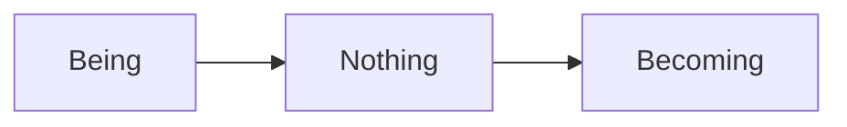

# Components

Beyond plain Markdown, `.mdx` files may use a small set of components that the
site provides. They are always in scope — **do not write an `import`
statement**, the compiler supplies them automatically and an import will break
the page.

Components only work in `.mdx` files. The two `.md` files in this section are
plain Markdown and are rendered as such.

## Callout

A coloured aside. `type` selects the colour and default icon (`default`, `info`,
`warning`, `error`, `important`); `emoji` replaces the icon with one of your
own.

```mdx
<Callout type="info">Worth knowing, but not essential.</Callout>

<Callout emoji="🔱">Anything can serve as the icon.</Callout>
```

## Cards

A responsive grid of links, used on section landing pages such as the one
listing these formatting guides.

```mdx
<Cards>
    <Cards.Card
        icon={" 📄 "}
        title="Basics of Markdown"
        href="/articles/contributing/formatting/basic-markdown"
    />
</Cards>
```

`Cards` accepts `num` to hint at the number of columns; `Cards.Card` accepts
`title`, `href`, `icon` and `arrow`.

## Tabs

Alternative readings or variants shown one at a time. Each label is turned into
a heading anchor, so `#main-reading` links to the tab of that name.

```mdx
<Tabs items={["Main Reading", "Alternative Reading"]}>
    <Tabs.Tab>The received interpretation.</Tabs.Tab>
    <Tabs.Tab>The dissenting one.</Tabs.Tab>
</Tabs>
```

## FileTree

For describing directory layouts. `Folder` takes `defaultOpen` to start
expanded, and both `Folder` and `File` take `active` to highlight an entry.

```mdx
<FileTree>
    <FileTree.Folder name="content" defaultOpen>
        <FileTree.File name="index.mdx" />
    </FileTree.Folder>
</FileTree>
```

## Stub and HotTopic

`Stub` marks a page as an invitation to contribute. `HotTopic` flags a contested
section and links to the discussions, or to a specific thread if you pass
`href`.

```mdx
<Stub />

<HotTopic href="https://github.com/systemphil/sphil/discussions/1" />
```

## EmbedYT

An embedded YouTube video. Use the `/embed/` form of the URL.

```mdx
<EmbedYT src="https://www.youtube.com/embed/hZVStcn2750" />
```

## Diagrams

Fence a diagram with `mermaid` and it is rendered client-side, following the
light or dark theme.

````mdx

````

## Code blocks

Ordinary fenced code blocks are syntax-highlighted and get a copy button. Name
the language after the opening fence:

````mdx
```bash
pnpm dev
```
````
