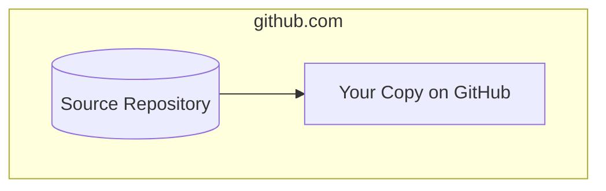
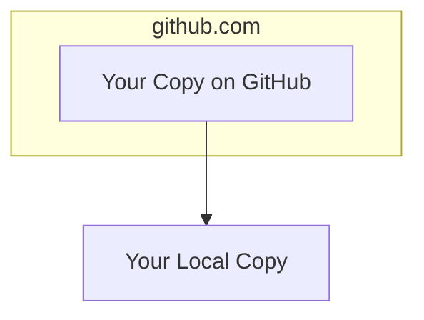
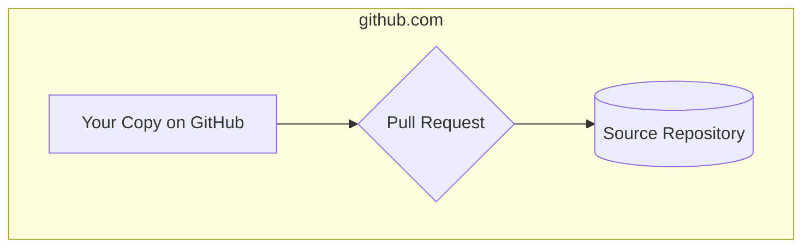

import { Callout } from "nextra/components";

# General GitHub Workflow

### Basic Setup

Forking a repository on GitHub involves creating your copy of someone else's
repository. It's a fundamental feature of GitHub that allows you to contribute
to projects, experiment with changes, or use the code as a starting point for
your own project.

1. **Creating a Fork:** On GitHub, you'll find a "Fork" button on the top right
   of a repository page. Clicking this creates a copy of the repository under
   your GitHub account.



2. **Your Copy:** The forked repository now exists in your GitHub account, and
   you can make changes to it without affecting the original repository. You can
   clone this fork to your local machine and start working on it just like you
   would with any other repository.



3. **Cloning**: To create a local copy, find the "Clone or download" button on
   your GitHub repository page. Clicking this button reveals a URL that you can
   use to clone the repository to your local machine using the `git clone`
   command. The full command looks like this:

```bash
git clone <url>
```

Notice that the repository on your local machine and the repository on GitHub
are now linked, but they _do not sync automatically_. To achieve this, you must
manually push and pull changes between them using the `git push` and `git pull`
commands.

### Making Changes

The basic workflow for making changes to a repository is as follows:

1. **Create a Branch:** When you're working on a project, you're going to want
   to create a branch for each new feature or bug fix you implement. This keeps
   your changes organized and allows you to work on multiple features at once
   without affecting the main codebase. To create a branch, use the
   `git checkout` command with the `-b` flag:

```bash
git checkout -b <branch-name>
```

2. **Make Changes:** Once you've created a branch, you can start making changes
   to the codebase. You can use the `git status` command to see which files have
   been modified, and the `git diff` command to see the exact changes you've
   made. When you're ready to commit your changes, use the `git add` command to
   add the files you want to commit, and the `git commit` command to commit
   them:

```bash
git add <file1> <file2> ... # or `git add .` to add all files
git commit -m "Commit message"
```

3. **Push Changes:** Once you've committed your changes, you can push them to
   your GitHub repository using the `git push` command:

```bash
git push origin <branch-name>
```

4. **Create a Pull Request:** Once you've pushed your changes to your GitHub
   repository, you can create a pull request to merge them into the main
   codebase. To do this, go to your repository page on GitHub and click the "New
   pull request" button. This will take you to a page where you can review your
   changes and create a pull request.



Note that any changes you make to your local repository after creating a pull
request will be included in the pull request automatically. This means that you
can continue working on your branch while the pull request is being reviewed.

Note also that you any changes you do locally must be pushed to your GitHub
repository before they can be included in the pull request.

5. **Review Changes:** Once you've created a pull request, you can review your
   changes and make sure everything looks good before merging them into the main
   codebase. You can also use this time to discuss your changes with other
   contributors and make sure everyone is on the same page.

6. **Merge Changes:** Once you and the collaborators are happy with your
   changes, you can merge them into the main codebase using the "Merge pull
   request" button on GitHub (or this will be done by one of the maintainers).
   This will merge your changes into the main codebase and close the pull
   request.

Note that you can only merge a pull request if there are no conflicts between
your changes and the main codebase. If there are conflicts, you will need to
resolve them before you can merge the pull request.

### Staying Up to Date

When you're working on a project, it's important to stay up to date with the
latest changes in the main codebase. This ensures that your changes are
compatible with the latest version of the codebase, and that you don't
accidentally overwrite someone else's work.

To sync your GitHub forked copy with the source repository, you can click the
sync button on your GitHub repository page. This will pull changes from the main
codebase into your GitHub repository, and allow you to continue working on your
branch without affecting the main codebase.

To stay up to date between your GitHub copy and local copy, you can use the
`git pull` command to pull changes from the main codebase into your local
repository. This will merge any changes that have been made since you last
pulled into your local repository, and allow you to continue working on your
branch without affecting the main codebase.

```bash
git pull origin main
```

Note that if you have uncommitted changes in your local repository, you will
need to commit them before you can pull changes from the main codebase.

<Callout type="info" emoji="ℹ️">
    What if you have worked on some changes in your local codebase but meanwhile
    there has been an update on the source repository? You can use the{" "}
    <code>git stash</code> command to temporarily store your changes, sync your
    GitHub copy with the source repository, pull the latest changes from the
    GitHub copy down to your local repository, and then apply your changes on
    top of them. Or, alternatively, after syncing your GitHub copy with the
    source repository, you can commit your current changes and then pull the
    changes from your remote GitHub copy down to your local repository, which
    will merge the incoming changes with yours. Note that conflicts may arise in
    both cases, which you will need to resolve manually.
</Callout>

### Resolving Conflicts

When you merge a pull request, GitHub will automatically try to merge your
changes into the main codebase. If there are any conflicts between your changes
and the main codebase, GitHub will notify you and allow you to resolve them
manually.

To resolve conflicts, you can use the `git merge` command to merge the main
codebase into your local repository. This will allow you to resolve any
conflicts manually before merging your changes into the main codebase.

```bash
git merge origin main
```

### Further information

You can read more about the GitHub flow
[here](https://guides.github.com/introduction/flow/).
