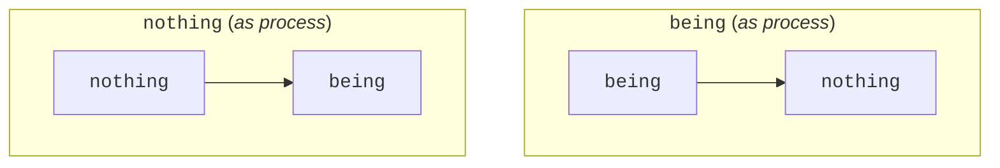

## The Development of Becoming

### The Unity of Being and Nothing

> _Pure being and pure nothing are therefore the same_. The truth is neither
> being nor nothing, but rather that being has passed over into nothing and
> nothing into being - “has passed over,” not passes over. But the truth is just
> as much that they are not without distinction; it is rather that _they are not
> the same_, that they are absolutely distinct yet equally unseparated and
> inseparable, and that _each_ immediately _vanishes in its opposite_. Their
> truth is therefore this _movement_ of the immediate vanishing of the one into
> the other: _becoming_, a movement in which the two are distinguished, but by a
> distinction which has just as immediately dissolved itself (Hegel 2010,
> 60-61/21.69-70).

The development of `becoming` picks up on the discovery made with the categories
[`being`](/hegel/reference/being/development) and
[`nothing`](/hegel/reference/nothing/development), namely, that `being` and
`nothing` have no distinguishing factor. As discussed elsewhere, there is a
[difference between `being` and `nothing`](/hegel/reference/nothing/difference-between-being-and-nothing)
but it is only an _immediate_ difference.

Hegel begins by pointing out that neither `being` nor `nothing` are stable
categories that simply exist, but that they each pass over into the other. The
truth of the matter is, then, that there is no such thing as `pure being`
_simpliciter_ that does not turn out to disappear into `nothing` (and vice
versa). This emphasizes the inseparability of the two categories.

Hegel then points out that these categories really are _distinct_. `Being` and
`nothing` are different conceptions, and this difference is important in
understanding the movement of `becoming`. It is insofar as `being` and `nothing`
pass over into each other&mdash;or vanish into its opposite&mdash;that a
movement has begun to take shape.

It is seen here how the immediate vanishing of `being` and `nothing` play a role
in forming an idea of movement which contains both the inseparability and
difference of the two categories. This "movement" of `becoming` establishes
something of a third element that groups the other two under a new identity, but
as already visible from the end of the quote, this unity is highly unstable.

Additionally, the term "vanishing" first appears here and is used extensively to
convey the passing of one category to the other as both immediate and absolute.
There is no further or deeper sub-process or mediation to deign here. Neither is
the passage partial or piecemeal; when one category _vanishes_ into another its
disappearance is instantaneous and total.

### The Moments of Becoming

#### Inseparability

> Becoming is the unseparatedness of being and nothing, not the unity that
> abstracts from being and nothing; as the unity _of being and nothing_ it is
> rather this _determinate_ unity, or one in which being and nothing equally
> _are_. However, inasmuch as being and nothing are each unseparated from its
> other, _each is not_. In this unity, therefore, _they are_, but as vanishing,
> only as _sublated_. They sink from their initially represented
> _self-subsistence_ into moments which are _still distinguished_ but at the
> same time sublated (Hegel 2010, 80/21.92).

import { Tabs } from "nextra/components";

<Tabs items={['Main reading', 'Alternative reading']}>

<Tabs.Tab data-name="main reading">

Here Hegel stresses that `becoming` is _not_ to be understood as just a static
unity that merely combines `being` and `nothing` side-by-side without taking
into account the nuances of their respective developments. Inasmuch as
`becoming` is regarded as the unity of the two categories it has specifically to
do with their inseparability.

However, this inseparability needs to be further qualified. If each category is
isolated with this inseparability, then it is negated on account that it does
not have any self-subsistence, reality or independence vis-à-vis the other it is
inseparable from.

Therefore, _the unity of_ `becoming` contains both categories as _moments_. This
sublated state does double work: first, it ensures the distinctiveness of each
category; second, it _also_ illustrates their inseparability through the shared
context.

Put differently, the developments of `being` and `nothing` lead to divergent
results: on the one hand, each is an immediate self-subsistent category totally
distinct from the other, but, on the other hand, each is indistinguishable from
the other and vanishes into that other, implying an undeniable inseparability.
This looks like a problem: How can these results be coherently understood
together? `Becoming` is the category that creatively combines these two results
through the idea of "moment": a logic that at once joins together while it
differentiates.

</Tabs.Tab>

<Tabs.Tab data-name="alternate reading">

Here `becoming` is further developed into two phases. First, as the
"unseparatedness" of `being` and `nothing`. Secondly, as the "unity" of `being`
and `nothing`. Hegel makes this distinction within `becoming` following the
inseparability and difference exposed in the
[first section](#the-unity-of-being-and-nothing) since each of these signal a
different conception with regards to how the category is understood.

For example, insofar as `being` is understood to be inseparable from `nothing`,
`being` does not have any self-subsistence, reality or independence and so its
meaning of `pure being` is negated and with it the category itself ("each is
not"). And, conversely, insofar as `being` is understood to be distinct from
`nothing`, it is joined into a determinate unity with `nothing` where the two
"equally are". In the second phase, Hegel adds additional qualifiers: each
category is present equally as the other yet only as vanishing and sublated.
This is important because the categories of `being` and `nothing` are not held
together immediately&mdash;`pure being` and `pure nothing` strictly cannot
co-exist&mdash;but as mediated moments. In other words, they are not held
together in their initial immediacy but as they disappear and are turned into
moments.

</Tabs.Tab>

</Tabs>

Before proceeding, it is worthwhile to note that, strictly speaking, `negation`
at this stage of the _Logic_ has not been developed. It does not, however, drive
the logic forward because it is used under a conditional that serves to
illustrate a wrong case, viz. isolating `being` or `nothing` concerning their
inseparability. Instead, the inseparability in question occurs exactly within a
higher-level context, namely, that of `becoming`.

Another thing to note is that it might be confusing, or counter-intuitive that
`being` and `nothing` are understood to be independent _whilst_ in a determinate
_unity_. This is part of the development of `becoming` where the issue is to
understand two terms as both identical and different. An issue yet to resolved.

#### Unequal Passage

> Grasped as thus distinguished, each is in their _distinguishedness_ a unity
> with the _other_. Becoming thus contains being and nothing as _two such
> unities_, each of which is itself unity of being and nothing; the one is being
> as immediate and as reference to nothing; the other is nothing as immediate
> and as reference to being; in these unities the determinations are of unequal
> value (Hegel 2010, 80/21.93).

Hegel explores the inseparability of `being` and `nothing` further from two
different vantage points. Why two? Because the main context of `becoming` that
unifies these two categories does not establish an abstract, static unity where
the two are merely side-by-side, since that does not account for their nuances.
Here we see those nuances become explicit in the thought that _being and
nothing_ is not equal to _nothing and being_. How is this so?

Initially, back in the earlier developments of `being` and `nothing`, each
simply _is_ or turns out to be the _same_ as the other. Now, it is understood
that `being` vanishes into `nothing`. In this context of `becoming`, the two
categories become regarded as one "passing into another", but this still
requires that one is a starting point and the other is the target. In other
words, the thought demands one is immediate and the other is the reference.

While this pattern of "passing into another" is valid for both, it plays out
very differently whether it is `being` that passes into `nothing`, or `nothing`
that passes into being. This is why Hegel states that the determinations in
these unities are of unequal value.

Once again, it is worth noting that Hegel has been using `determinate-` and
`determination` in this section, and, like `negation`, these are terms not
explicitly developed in the logic. Unlike `negation`, however, the terms at hand
seem to do more work for the argument. On the one hand, determination here may
not be used in a technical sense and merely makes the difference between `being`
and `nothing` more poignant. On the other hand, however, the term stresses drive
and resolution, and a sharp unity of fixed difference, which prefigures a later
category. Its usage here is somewhat misleading, if not problematic, and Hegel
could quite easily have replaced it with less technically charged words without
affecting the argument.

#### Emergence and Cessation

> Becoming is in this way doubly determined. In one determination, nothing is
> the immediate, that is, the determination begins with nothing and this refers
> to being; that is to say, it passes over into it. In the other determination,
> being is the immediate, that is, the determination begins with being and this
> passes over into nothing &ndash; _coming-to-be_ and _ceasing-to-be_ (Hegel
> 2010, 80/21.93).

The two unities of `being` and `nothing` are recast into coming-to-be and
ceasing-to-be based on which direction the passage occurs. The unequal value of
these passages is perhaps more clear now in the rephrasing, since it spells out
that it is being, in both accounts (coming-_to-be_ and ceasing-_to-be_), which
either arrives or departs.

What is key is that Hegel relates this back to `becoming`. It is in the context
of movement that the inseparability of the two categories is made explicit, and
any further details discovered will reflect back on this context.

A possible complication to the logic is that the coming-to-be and
ceasing-to-be&mdash;which currently is defined with the vanishing of `being`
into `nothing` and `nothing` into `being` respectively&mdash;could be equally
applied over the category `nothing` itself. That is to say, `nothing` could be
coming-to-be where _its_ self-subsistence _as nothing_ concerned and
creasing-to-be when _it_ vanishes into `being`. This idea, while tempting at
first, is not really coherent. Firstly, it presupposes the original coming-to-be
and ceasing-to-be vis-à-vis `being` and `nothing`; secondly, it breaks the
definition of `nothing` as the absolute absence of `being`, which is required
for the original movement. Therefore, the coming-to-be and ceasing-to-be cannot
apply to `nothing` except in a very abstract or non-substantive sense.

#### Mutual Paralysis

> Both are the same, becoming, and even as directions that are so different they
> interpenetrate and paralyze each other. The one is _ceasing-to-be_; being
> passes over into nothing, but nothing is just as much the opposite of itself,
> the passing-over into being, coming-to-be. This coming-to-be is the other
> direction; nothing goes over into being, but being equally sublates itself and
> is rather the passing-over into nothing; it is ceasing-to-be. &ndash; They do
> not sublate themselves reciprocally &ndash; the one sublating the other
> externally &ndash; but each rather sublates itself in itself and is within it
> the opposite of itself (Hegel 2010, 80-1/21.93).

While two specific movements of coming-to-be and ceasing-to-be point in opposite
directions, they fold into same `becoming` and come to mirror the initial
inseparability that defined `being` and `nothing`.

Importantly, the source of each specific movement _is_ in the root category in
question and there is no external action or cause that the made the category
operate in the way that it did, namely, that it vanished into its other. Putting
it plainly, `being` _is_ ceasing-to-be as it vanishes into `nothing`, but
likewise `nothing` _is_ coming-to-be as it vanishes into `being`.

In addition, Hegel writes that the two specific movements interpenetrate and
paralyze each other. How do they relate and why would they paralyze each other?

In the first place, the two specific movements relate because they are of the
same inseparability; the same `becoming` defines coming-to-be and ceasing-to-be.
Once this is understood, the issue with their opposite movements should become
clear, namely, the same `becoming` is a movement _both_ of coming-to-be _and_
ceasing-to-be. Recall that for `pure being` and `nothing`, their vanishing is
total and absolute, and occurs immediately. Indeed, the vanishing is so
immediate that Hegel indicates it by stating it is
[not passing but has passed](#the-unity-of-being-and-nothing). As the categories
are this unstable, effectively coming-to-be _is_ ceasing-to-be, and
ceasing-to-be _is_ coming-to-be&mdash;emergence and cessation occur
simultaneously within the same context. Therefore, `becoming`, if Hegel is
right, is a double movement of rising and falling.

### Sublation of Becoming

#### Quiescent Result and Destruction

> The equilibrium in which coming-to-be and ceasing-to-be are poised is in the
> first place becoming itself. But this becoming equally collects itself in
> _quiescent unity_. Being and nothing are in it only as vanishing; becoming
> itself, however, is only by virtue of their being distinguished. Their vanish-
> ing is therefore the vanishing of becoming, or the vanishing of the vanishing
> itself. Becoming is a ceaseless unrest that collapses into a quiescent result
> (Hegel 2010, 81/21.93).

Hegel goes into more detail here on how coming-to-be and ceasing-to-be paralyze
not only each other but the unity that constitutes them. Importantly, he points
out how `becoming` depends on the _difference_ between `being` and `nothing`,
but as it has been understood, this difference itself immediately dissolves
since there is nothing determinate to support it. In other words, the difference
itself emerges as it ceases. Given that the moments of `becoming` lose their
difference, the dependencies of the movement are gone and with it `becoming`
collapses into a quiescent result.

Put differently, `becoming` depends on the vanishing of `being` and `nothing`,
but this vanishing is itself unsustainable and thus vanishes, hence Hegel's
phrase "the vanishing of the vanishing".

> This can also be expressed thus: becoming is the vanishing of being into
> nothing, and of nothing into being, and the vanishing of being and nothing in
> general; but at the same time it rests on their being distinct. It therefore
> contradicts itself in itself, because what it unites within itself is
> self-opposed; but such a union destroys itself (Hegel 2010, 81/21.93-4).

Hegel repeats the point, but sharpens the idea of an internal opposition within
`becoming` itself. Its movement brings together contradictory impulses and is
torn asunder by the unrelenting indeterminacy of `pure being` and `nothing`.

`Becoming` is the attempt, one might say, to bring some coherence to the
conflicting motions of the early categories by carefully noting what must be the
case: `being` and `nothing` _are_ different, they _are_ the same and they vanish
into one another. The tools by which `becoming` puts these divergent and
incompatible ideas, such as moments, movement, coming-to-be and ceasing-to-be,
are innovative and creative, but equally cannot contain the fury of negativity
latent within them. `Becoming` itself thus emerges and perishes.

#### Not Nothing

> This result is a vanishedness, but it is not _nothing_; as such, it would be
> only a relapse into one of the already sublated determinations and not the
> result of nothing _and of being_. It is the unity of being and nothing that
> has become quiescent simplicity. But this quiescent simplicity is _being_, yet
> no longer for itself but as determination of the whole (Hegel 2010, 81/21.94).

The vanishing of the vanishing would return one to the category `nothing`, but
Hegel claims that this is not so. The first reason is that this would only put
the logic back a few steps and _those_ steps would lead precisely _back_ to the
present circumstance. Now, it may be that the logic merely loops around
endlessly between `nothing` and `becoming` from this point on, but even this
loop would be a new result, and one that displays characteristics of stability
not seen before. The second reason is that this relapse does not take into
account the complete outcome of `being` and `nothing`, viz. how they are
inseparable.

It is exactly this inseparability that is left after the rise and fall of
`becoming`: the vanishing of `being` and `nothing` cannot be coherently
determined since it itself vanishes, but it remains a fact that these two pure
categories are deeply entangled and the motion of their vanishing is matched
only by the inertia of their belonging.

`Being` and `nothing` are thus understood to be simply together, but this
togetherness itself falls under the header of `being` since this unity _is_. As
seen above with the specific movements, it is `being` that comes-to-be and
ceases-to-be. Now a new being must be defined, since the being of `being` and
`nothing` is no longer pure.

import { HotTopic } from "lib/components/ui/HotTopic";

<HotTopic />

#### Stepping Out

> Becoming, as transition into the unity of being and nothing, a unity which is
> as existent or has the shape of the one-sided _immediate_ unity of these
> moments, is _existence_ (Hegel 2010, 81/21.94).

The being of `being` and `nothing` is `existence` (`determinate being`). It
designates a new immediacy but minimally determinate since it presents at once a
combination of different moments. The moments of `becoming`, by contrast, had to
be _mediated_ through the context of inseparability. And it can be seen here how
`existence` is the real becoming of `becoming`, as the movement of the latter
turned out to be the process that engendered the being that was moved. Thus,
`becoming` cannot logically be at rest with itself. Like its preceding
categories, it cannot remain pure and vanishes into what determined itself.

If Hegel is right, `pure becoming` is an incoherent and incomplete idea, or
there is no such thing, ontologically, as simple becoming. And while `existence`
may turn out to be many things, both in the _Logic_ and elsewhere in philosophy
and beyond, it cannot be anything less than that which is both `being` and
`nothing`.

## Further Commentary

### Burbidge

John Burbidge's analysis of `becoming` begins from the thought that `being` and
`nothing` cannot be held in isolation, as discrete abstractions. Failing to hold
these absolutely different, they are brought to relation and this forces the
understanding to examine this reference: "The only way the difference can be
maintained is through reference to the process of thought itself. For it alone
indicates that they are not simply identical" (Burbidge 1981, 40).

The difference and sameness of `being` and `nothing` constitute two aspects that
are brought together in a synthetic relationship of unity and difference. What
is important here is that the independence of both categories is in favor of
being retained as moments. Burbidge names the movement of `being` to `nothing`
_genesis_, and the converse movement _perishing_ (Burbidge 1981, 41). And as
each movement completes, it is itself transformed to its opposite: perishing
dissolves into a new process of genesis and genesis into perishing. They are
both, however, moments of the overall category `becoming`, and so form a double
process.

Burbidge writes that `becoming` depends on `being` and `nothing` to be perfectly
different and that it ceases if they are understood to be the same. However,
`becoming` depends on `being` and `nothing` being _both_ perfectly different
_and_ exactly the same. The contradiction of `becoming` is rather that its very
process turns them from their absolute vanishing&mdash;which is derived from
their immediate difference and sameness&mdash;into related moments.

The result of the mediation of `becoming` is brought about by thought moving to
a new perspective that grasps that `being` and `nothing` are not simply
opposites but are "subcontraries of a more inclusive category", which, by virtue
of being an intellectual concept, Burbidge asserts "must be" (Burbidge 1981,
41). The collapse of `becoming` into this unity Burbidge names "a being"
[_Dasein_], as he goes on to write: "The indefinite article suggests that it is
not absolutely indeterminate but is in some way limited by a nothing out of
which it comes and to which it may return" (Burbidge 1981, 42).

Burbidge's decision to name _Dasein_ "a being" is puzzling and his reasoning for
it is less clear. The term relies on implicit assumptions rather than
designating a well defined meaning; "a being" may well suggest that it is not
absolutely indeterminate, but it also suggests that it is one being among many,
which is something _Dasein_, or `Existence`, definitely is not. Unfortunately,
the term Burbidge chose pollutes the thought of the logic rather than clarifying
it.

### Houlgate

With the category `becoming` Hegel has reached the standpoint of Heraclitus,
where everything flows and all is becoming (Houlgate 2022, 147). Stephen
Houlgate contends that at this point in the _Logic_, Hegel fully affirms a
Heraclitean vision of a ceaselessly changing reality; Hegel "is affirming a
Heraclitean vision of sheer _becoming_" (Houlgate 2022, 147). Importantly,
though, Houlgate points out that Hegel shows us this Heraclitean vision _by_ the
standpoint of Parmenides, namely, the standpoint of `pure being` (although
Parmenides himself would never leave his standpoint).

The `becoming` Hegel examines, however, is not a becoming understood to occur
_in time_. Rather, it is only the transition of `pure being` and `nothing` into
one another. As human thinkers, we need time to think this transition; but
`pure being` does not prove to be `nothing` in virtue of time passing, but in
virtue of what turns out to be logically the case conceptually.

> ...the _process_, described in logic, in which being proves to be becoming
> (and then further forms of being) is not temporal ... It is the logical
> process in which being discloses what it is in truth. Hegel's claim is thus
> not that in time there is first being, then nothing and then becoming, but
> that logically being itself proves to _be_ becoming (as it will later prove to
> be substance, the Idea and space-time)(Houlgate 2022, 148).

In Houlgate's reading, the categories `being` and `nothing` undergo a twofold
transformation, namely, turning into processes of which they are themselves
moments. `Nothing` does not simply vanish into `being`, but proves _to be_ that
vanishing, the very transition into its opposite. In that sense, it proves to be
the process of coming-to-be.

In this _process of_ `nothing`, `nothing` itself is immediate and passes over
into `being`, such that the process itself contains `nothing` and `being` as its
two moments. The same holds for the process of `being`. "As becoming, therefore,
being and nothing are the process of _vanishing_ itself; but, as moments of
becoming, they are each _that which_ vanishes into the other" (Houlgate 2022,
149). In Houlgate's understanding, then, `being` and `nothing` are each seen
both as the _process_ of vanishing (or becoming) and as _moments_ of the
vanishing, respectively.

In Houlgate's estimate, `becoming` inaugurates a more stable thought, albeit one
of restless instability. His point, however, is that the thought of `becoming`
does not immediately vanish into another category, as with `being` and
`nothing`. This requires a more active participation by thought in order to
uncover what is immanent in the category. However, Houlgate warns that this does
not make the logic something "artificially engineered by us", but made necessary
by what is inherent in `becoming` itself (Houlgate 2022, 150). Indeed, as
revealed in the examination of the [development](#the-development-of-becoming),
`becoming` does not immediately turn into something else but spawns a process of
`becoming`.

The exact nature of the vanishing of `being` and `nothing`, which is key to
understanding `becoming`, is in recognizing that `being` and `nothing`, Houlgate
writes, "cannot merely vanish _into one another_ &ndash; for in that way, they
do not actually vanish &ndash; but must vanish _into their both having
vanished_" (Houlgate 2022, 151). The result of this vanishing of the vanishing
can itself neither _be_ `pure being` nor `pure nothing`&mdash;since that exactly
returns the vanishing&mdash;but one where a unity or inseparability of `being`
and `nothing` where their _purity_ and _pure immediate difference_ have been
annihilated.

The movement of `becoming` requires this very purity and difference, however,
and without it, `becoming` itself is brought to a halt. _But it is `becoming`
itself which brings about this halting_. In a manner of speaking, it is a
process that is generated by a source but within that generation the source
altered and the process itself ceases, leaving the altered source. As Houlgate
concludes, "We move forward from becoming to determinate being, therefore, not
because we prefer stability over instability, but because we take seriously the
_loss of purity_ that is only inadequately embodied in becoming" (Houlgate 2022,
152).

Surprisingly, then, the problem with Heraclitean `becoming` from Hegel's point
of view, according to Houlgate, is not that it denies the purity of Parmenidean
`being` but that it actually clings to it all too firmly. `Becoming` feeds off
the purity of `being`&mdash;and in some respects, mimics it&mdash;since it
requires the loss _and_ re-emergence of it; in `becoming`, `pure being` is
contained intact. Both philosophers fail to see that, logically, `pure being`
must transform itself to _determinate_ `existence`, where no purity is the case
at all (Houlgate 2022, 152).

### McTaggart

John McTaggart aptly puts it that `being` and `nothing` only exist in `becoming`
as disappearing moments, but that these very moments must be separate, for, "if
they are not separate, how can they pass into one another" (McTaggart 1910, 17).

McTaggart thinks that `becoming` was inadequately named by Hegel, since he
contends that this term is too concrete and that it brings with it too many
unwanted connotations. He suggests that the synthesis (his term) of `being` and
`nothing` should have been named "transition to being determinate" [_Übergang
in das Dasein_] (McTaggart 1910, 20), pointing to the precedent Hegel set in the
case of the last category of `measure`, called "transition to essence". What are
McTaggart's reasons for this claim? Why is "becoming" inadequate?

In order to better understand McTaggart's standpoint, it must first be
understood that he maintains that `being` is dependent on `nothing` in order
that it should be `being` and vice versa.

> In other words, a category of Being without Nothing, or of Nothing without
> Being, is inadequate and leads to contradictions which prove its falsity. The
> only truth of the two is a category which expresses the relation of the two
> (McTaggart 1910, 17).

There is no contradiction in the union of `being` and `nothing`, at least not in
the manner seen in the development of `becoming` concerning their exact identity
and pure difference.

Now, the issues McTaggart sees in the term "becoming", are specifically:

1. The term "becoming" evokes the idea of a process of change. A change of
   something to something else.
1. Change, in turn, involves the existence of some permanent element in what
   changes. An element that does not change. Put differently, change requires
   some stable form to contrast the contends that were changed.
1. It is impossible in the categories of `being` and `nothing`, since there is
   no room for distinction between a changing and an unchanging layer of reality
   as the categories are simply undifferentiated.
1. Therefore, if something should be capable of change, it must be analyzable
   into two elements, one which does not change. "This is impossible under the
   categories of Quality", McTaggart claims (McTaggart 1910, 17).

McTaggart considers the scenario that `becoming` may not be a fully developed
sense of change, but change in a more rudimentary form. Rather than change of A
into B, it is the disappearance of A and the appearance of B. But McTaggart
thinks that even in the latter case, when carefully analyzed, would "involve the
presence of some element which persisted unchanged in connection first with A
and then B", and that would just be change proper (McTaggart 1910, 19).

Furthermore, McTaggart contends that the essence of the new category
(`existence`) is in the necessary implication of `being` and `nothing` and "not
in any change taking place between them" (McTaggart 1910, 19).

Reviewing McTaggart's commentary on `becoming`, it appears to deal more with
possible semantic implications rather than with the technicalities of the
argument, which problematizes his reading. Here are a few points to consider.

1. Firstly, nowhere does Hegel employ "change" to describe the movement of
   `becoming`; rather, he carefully combines ideas of "vanishing". So while
   McTaggart is right that change requires some permanent element, and therefore
   does not map on to the logic of `becoming`, it was never asked for by the
   argument of the _Logic_. Instead, it is better to think of `becoming` not as
   any species of change but simply as _becoming_, a unique logical movement.
1. Secondly, McTaggart's understanding that `existence` is merely the necessary
   implication of `being` and `nothing`, omits the important point that these
   can no longer be thought in their purity (see
   [Houlgate's commentary on this](#houlgate)).
1. Thirdly, misnaming `becoming` with preference for the much more generic
   "transition to determinate being", while not relevant to the logic, would
   miss out on the historical debt being paid to Heraclitus and could therefore
   make the category less accessible.

Against McTaggart, then, the question of change is taken up later in the
_Logic_, when the categories of `determination`, `constitution` and `limit`
become explicit. In `becoming`, by contrast, the issue is rather about
explicating vanishing and pure, radical movement, which may later factor into
the idea of change but in no way, logically, presuppose it.
