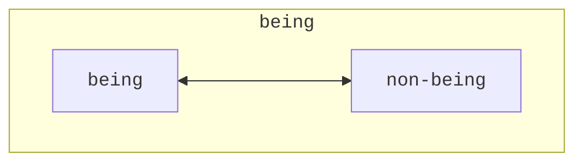

## The Development of Existence

### The Immediacy of Existence

> Existence proceeds from becoming. It is the simple oneness of being and
> nothing. On account of this simplicity, it has the form of an _immediate_. Its
> mediation, the becoming, lies behind it; it has sublated itself, and existence
> therefore appears as a first from which the forward move is made. It is at
> first in the one-sided determination of _being_; the other determination which
> it contains, _nothing_, will likewise come up in it, in contrast to the first
> (Hegel 2010, 83/21.97).

While the category of existence is derived from
[becoming](/articles/hegel/reference/becoming/development)&mdash;and thus has
its justification therein&mdash;it is at first regarded in its immediacy. In
regards of this immediacy, existence is _simple_, and therefore the mediation
that brought it out is put behind it and it appears as "a first". In other
words, the thought of existence does not need to appeal to `becoming`, or its
mediation, in order _to be_. To illustrate: to point something out as _existing_
minimally determines a simple oneness of `being` and `nothing`, but does not, on
the face of it, point to any `becoming` or movement. There is just existence.
One simply exists.

### The Unity of Being and Non-being

The simplicity of `existence` is quickly complicated, as the apparent oneness of
`being` and `nothing` means that more is at work in `existence`, since these
categories
[cannot co-exist](/articles/hegel/reference/becoming/development#the-unity-of-being-and-nothing).
As Hegel goes on to write:

> As it follows upon becoming, existence is in general _being_ with a
> _non-being_, so that this non-being is taken up into simple unity with being.
> _Non-being_ thus taken up into being with the result that the concrete whole
> is in the form of being, of immediacy, constitutes _determinateness_ as such
> (Hegel 2010, 84/21.97).

Two things are key in this passage. First, `nothing` is recast as `non-being`
since the category `nothing` strictly _cannot_ be set in contrast with anything,
much less `being`, as it is _purely_ `nothing`. It thus cannot conceptually
co-exist with anything else. `Non-being` serves therefore as the part of the
oneness in which `being` vanishes into and emerges out of `nothing`. As
`non-being`, `nothing` is involved but only inasmuch as it is encapsulated by
`being`.

The second matter is that the unity of `being` and `non-being` that constitutes
`existence` is itself in the form of `being`.

The fact that `being` and `non-being` are in the form of `being` ensures their
unity while also containing their difference. This unity clearly is concrete
since it both brings together as well as holds apart divergent elements. This is
exactly what establishes _determinateness_ for Hegel. But how does it achieve
that? What exactly is implied in this immediate form of determinateness?

### Determinateness as a Concrete Whole

> The _whole_ is likewise in the form or _determinateness_ of being, since in
> becoming being has likewise shown itself to be only a moment – something
> sublated, negatively determined. It is such, however, _for us_, _in our
> reflection_; not yet as _posited_ in it. What is posited, however, is the
> determinateness as such of existence, as is also expressed by the _da_ (or
> “there”) of the _Dasein_ (Hegel 2010, 84/21.97).

This passage is tricky since since it appears that Hegel looks ahead from the
current situation. In _our_ reflection&mdash;as concrete thinkers with more
concepts available to us than the logic at hand&mdash;is it noted that the
whole, or the unity, of `being` and `non-being` must equally be a _determined
being_, no less than its constituent moments. Though this is not evident in the
immanent development.

Following this passage, Hegel appears to
[insert a comment](/articles/hegel/reference/_annotations/textual#inline-comments)
about the nature of positing, which serves to show that the distinction just
made was for educational purposes rather than demonstrating anything about the
development.

> Existence corresponds to being in the preceding sphere. But being is the
> indeterminate; there are no determinations that therefore transpire in it. But
> existence is determinate being, something concrete; consequently, several
> determinations, several distinct relations of its moments, immediately emerge
> in it (Hegel 2010, 84/21.98).

Hegel ends this section by stating that `existence` corresponds to `being` but
that while the latter was indeterminate, the former is, by contrast,
determinate. Two more key things to note in this passage is the meaning of
"determinations transpiring" in a category and the idea that _several_
determinations and distinctions _immediately_ emerge. From the latter,
`existence` is regarded as something immediately complex, as was already
understood from the preceding despite its simplicity. But exactly
this&mdash;which relates to the former matter about "transpiring"&mdash;reveals
the glimmers, as it were, of a movement amidst this static determinacy.

#### Is the Whole an External Reflection (Niklas)

Hegel notes that "The _whole_ is likewise in the form or _determinateness_ of
being [is such] _for us, in our reflection_ (Hegel 2010, 84/21.97). Stephen Houlgate
[elaborates](#houlgate) that this difference is between, on the one hand, regarding
`existence` as _immediate_ and therefore containing `being` and `non-being` as its
moments but where `being` predominates, as it appears _for us_ in our reflection;
against, on the other hand, `existence` as simply the unity of `being` and `non-being`
where neither one has the greater emphasis.

It is puzzling why Hegel should have to raise a problem of external reflection
here. If the issue appears to stem from over-emphasizing `being` over
`non-being`, which comes from the element of immediacy, then what other recourse
is possible for the development of `existence`? Is there any other pure thought
available of `existence` that does _not_ determine that the unity of `being` and
`non-being` _is_? If that unity is understood to be an external reflection, then
the root cause&mdash;namely, the immediacy of `existence`&mdash;must also be
problematic, but then the issue is no longer that of an external reflection.

There seems to be three approaches one could explore. Either the oneness, or
unity, of `being` and `non-being` is or is not. Or the matter with the external
reflection is itself an external reflection that is unwarranted. Or, the logical
development here needs to be revised.

### Textual Note

The German _Dasein_, which Hegel uses for the category in question, has been
translated into `existence` by George Di Giovanni. It has also been translated
into `determinate being` or `a being`. While these other translations are not
incorrect, there are some additional benefits with using `existence`. It is both
more precise and is linguistically more natural. As Di Giovanni writes, "All
_Dasein_ is 'determinate being,' but not all 'determinate being' is merely
_Dasein_. Moreover, using 'determinate being' makes the task of translating such
derivatives as _seiend_, _Seiendes_, and _Daseiendes_, practically impossible or
at least very cumbersome" (Hegel 2010, lxviii).

Hegel also notes that the spatial connotation in the German _Dasein_ does not
belong to the conceptual use made in the _Logic_, since space is not made
explicit until the _Philosophy of Nature_. Rather, as Houlgate notes, the prefix
"da" means "nothing more than the element of definiteness or determinacy that
distinguishes _Dasein_ from pure, indeterminate _Sein_" (Houlgate 2022, 157).

## Further Commentary

### Houlgate

Stephen Houlgate provides his reasoning as to why, in `existence`, `being` is
united with `non-being`:

> In _Dasein_ being is united with a nothing that is also different from it.
> Insofar as nothing is different from being, however, it is itself inseparable
> from being. It is thus no longer just nothing, but nothing or the “not”
> (_Nicht_) that is explicitly connected to, and one with, being. The explicit
> unity of the not and being is expressed in the thought of _not_-being or non-
> being. Earlier in the Logic Hegel insists that nothing should initially be
> thought as pure nothing, or the mere not, by itself, and so as “devoid of
> relation” to being. Now, however, the not is inseparable from being: it is the
> not, or “non”, as a form _of_ being. The negative moment with which being is
> united in _Dasein_ is thus no longer nothing, but non-being (Houlgate 2022,
> 158).

Houlgate stresses the simplicity of `existence`: without the moment of
`non-being`, being reverts to pure, _indeterminate_ `being` (_Sein_), but with
that moment, however, `being` is converted to _determinate_ being or `existence`
(_Dasein_). The moment of `non-being` constitutes determinacy as such. "Being is
determinate, therefore, only because it is this-_not_-that" (Houlgate 2022,
158).

Why does `existence` emphasize the moment of `being`, or that `being` is what
comes initially to the fore here? Houlgate answers that once `becoming` settles
into `existence`, the former has vanished and the latter has emerged as the only
remaining. There is no relation from one to the other. Houlgate writes, "it
stands there alone as an '_immediate_', as simply itself. By virtue of that
_immediacy_, however, it is 'in the one-sided determination of _being_': it
simply _is_ what it _is_" (Houlgate 2022, 158). However, this one-sidedness is
something we, as observers of the logical development, see. It is not something
inherent in the immediacy of `existence` as such, "because _we_ do not see as
much non-being in it as being" (Houlgate 2022, 158).

While the inseparability of `being` with a negative seems uncontested, there
could be issues with defining this negative element precisely (or too
precisely). Houlgate uses "not", which seems to belong to the category of
`negation`, and that is not derived at this stage in the _Logic_. In fact,
`negation` becomes explicit in the section that follows this one, namely, the
section on Quality.
