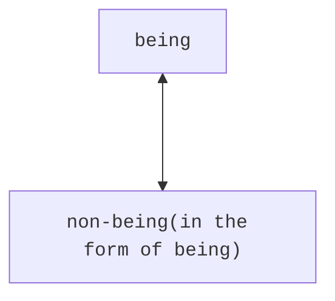
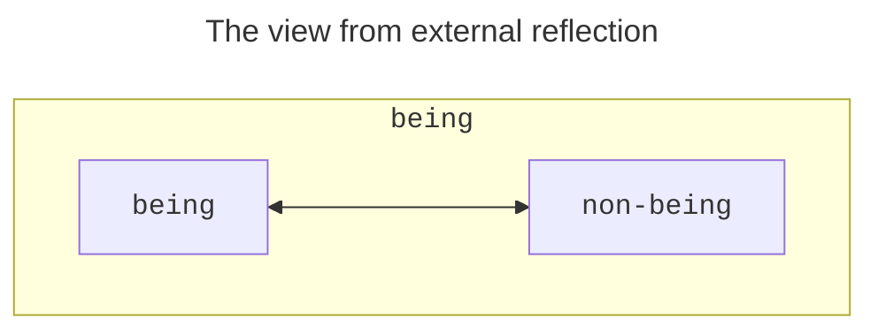

## The Development of Existence

### The Immediacy of Existence

> Existence proceeds from becoming. It is the simple oneness of being and
> nothing. On account of this simplicity, it has the form of an _immediate_. Its
> mediation, the becoming, lies behind it; it has sublated itself, and existence
> therefore appears as a first from which the forward move is made. It is at
> first in the one-sided determination of _being_; the other determination which
> it contains, _nothing_, will likewise come up in it, in contrast to the first
> (Hegel 2010, 83/21.97).

While the category of `existence` is derived from
[becoming](/articles/hegel/reference/becoming/development)&mdash;and thus has
its justification therein&mdash;it is at first regarded in its immediacy. As
immediate, `existence` is _simple_, and the mediation that brought it out is put
behind it. In this way, `existence` appears as "a first". In other words, the
thought of existence does not need to appeal to `becoming`, or its mediation, in
order _to be_. To illustrate: to point something out as _existing_ minimally
determines a simple oneness of `being` and `nothing`, but does not, on the face
of it, point to any `becoming` or movement. There is just existence. One simply
exists.

### The Unity of Being and Non-being

The simplicity of `existence` is quickly complicated, as the apparent oneness of
`being` and `nothing` means that more is at work in `existence`, since these
categories
[cannot co-exist](/articles/hegel/reference/becoming/development#the-unity-of-being-and-nothing).
As Hegel goes on to write:

> As it follows upon becoming, existence is in general _being_ with a
> _non-being_, so that this non-being is taken up into simple unity with being.
> _Non-being_ thus taken up into being with the result that the concrete whole
> is in the form of being, of immediacy, constitutes _determinateness_ as such
> (Hegel 2010, 84/21.97).

Two things are key in this passage. First, `nothing` is recast as `non-being`
since the category `nothing` strictly _cannot_ be set in contrast with anything,
much less `being`, as it is _purely_ `nothing`. It thus cannot conceptually
co-exist with anything else. `Non-being` serves therefore as the part of the
oneness in which `being` vanishes into and emerges out of `nothing`. As
`non-being`, `nothing` is involved but only inasmuch as it is encapsulated by
`being`.

The second matter is that the unity of `being` and `non-being` that constitutes
`existence` is itself in the form of `being`. Though, as will be qualified, this
"form of `being`" is very nuanced.

The fact that `being` and `non-being` are in the form of `being` ensures their
unity while also containing their difference. This unity appears to be concrete
since it both brings together as well as holds apart divergent elements. This is
exactly what establishes _determinateness_ for Hegel. But how does it achieve
that? Is `being` a container of `being` and `non-being`? What exactly is implied
in this immediate form of determinateness?

### Determinateness as a Concrete Whole

> The _whole_ is likewise in the form or _determinateness_ of being, since in
> becoming being has likewise shown itself to be only a moment – something
> sublated, negatively determined. It is such, however, _for us_, _in our
> reflection_; not yet as _posited_ in it. What is posited, however, is the
> determinateness as such of existence, as is also expressed by the _da_ (or
> “there”) of the _Dasein_ (Hegel 2010, 84/21.97).

This passage is tricky since since it appears that Hegel looks ahead from the
current situation. In _our_ reflection&mdash;as concrete thinkers with more
concepts available to us than the logic at hand&mdash;is it noted that the
whole, or the unity, of `being` and `non-being` must equally be a _determined
being_, no less than its constituent moments. Though this is not evident in the
immanent development.

Following this passage, Hegel appears to
[insert a comment](/articles/hegel/reference/_annotations/textual#inline-comments)
about the nature of positing, which serves to show that the distinction just
made was for educational purposes rather than demonstrating anything about the
development.

> Existence corresponds to being in the preceding sphere. But being is the
> indeterminate; there are no determinations that therefore transpire in it. But
> existence is determinate being, something concrete; consequently, several
> determinations, several distinct relations of its moments, immediately emerge
> in it (Hegel 2010, 84/21.98).

Hegel ends this section by stating that `existence` corresponds to `being` but
that while the latter was indeterminate, the former is, by contrast,
determinate. Two more key things to note in this passage is the meaning of
"determinations transpiring" in a category and the idea that _several_
determinations and distinctions _immediately_ emerge. From the latter,
`existence` is regarded as something immediately complex, as was already
understood from the preceding despite its simplicity. But exactly
this&mdash;which relates to the former matter about "transpiring"&mdash;reveals
the glimmers, as it were, of a movement amidst this static determinacy.

#### Is the Whole an External Reflection? (Niklas)

Hegel notes that "The _whole_ is likewise in the form or _determinateness_ of
being [is such] _for us, in our reflection_ (Hegel 2010, 84/21.97). Stephen
Houlgate [elaborates](#houlgate) that this difference is between, on the one
hand, `existence` as _immediate_ and therefore containing `being` and
`non-being` as its moments but where `being` predominates, in contrast to, on
the other hand, `existence` as simply the unity of `being` and `non-being` where
neither one has the greater emphasis. The former is that way because it appears
_for us_ in our reflection.

It is puzzling why Hegel should have to raise a problem of external reflection
here. If the issue appears to stem from over-emphasizing `being` over
`non-being`, which comes from the element of immediacy, then what other recourse
is possible for the development of `existence`? Is there any other pure thought
available of `existence` that does _not_ determine that the unity of `being` and
`non-being` _is_? If that unity is understood to be an external reflection, then
the root cause&mdash;namely, the immediacy of `existence`&mdash;must also be
problematic, but then the issue is no longer that of an external reflection.

There seems to be at least four avenues one could explore from here. Either the
oneness, or unity, of `being` and `non-being` is or is not. Or the matter with
the external reflection is itself an external reflection that is unwarranted. Or
an external reflection really has taken place on erroneous grounds and it not
yet clear as to why, or if it follows necessarily from the logic. Or, finally,
the logical development here needs to be revised.

#### Immediacy and Determinateness (Niklas, Yirmibes)

Further to the issue of why an one-sided determination and an external
reflection arises in the first Existence section. First, does oneness imply
wholeness? The term `whole` is a category of Essence, which is later developed
in the _Logic_, and, as the movement roughly is explicated there, the `whole`
presupposes `parts`. Insofar as the `whole` is here evoked, it may simply imply
`parts`, and that gets thought into the mire of one-sided determination. Put
simply, to identify a concept as one-sided (a whole), one should already know
more than the one-sidedness of the concept. Since what will come has not yet
been made explicit (posited), one can only determine this one-sidedness as if it
is _for us_, in our reflection. This is exactly what Hegel attempts to prevent
in the development here by alerting us to the fact that there is no
one-sidedness of `existence`; that this thinking is an external imputation upon
the matter by us and that it does not follow immanently. This external
reflection can possibly be traced back to the very notion of a `whole`.

However, why does the `whole` become relevant here in the first place? What
could trigger the external reflection as such?

Is the problem that there is an appearance of determinateness (or a seeming of
it) at the _immediacy_ of `existence`? Because _immediacy_ as such, were it
pure, is incongruent or incompatible with determinateness, which cannot be
merely immediate. On some level, every category in the _Logic_ faces this
problem since they are each initially _immediate_ or have `being`. But here,
however, the problematic is taken to its extreme since there is no determination
that could be attached to the _immediacy_ of `existence`. In other categories,
it is more readily known that the immediacy of a concept is a mediated
immediacy.

One could claim that `existence`, initially posited, just is the immediacy of
the unity of `being` and `non-being`, and there is nothing more to the
matter&mdash;no determinateness. However, Hegel's argument in this section is
that this precise immediacy necessarily produces determinateness. It produces
determinateness in virtue of both being `being` and `non-being`, and, `being`
_and_ `non-being`. In the immediacy, the emphasis falls on the simple oneness of
these categories. But, this immediacy of oneness vanishes in favor for a
mediated togetherness. However, these two phases contradict each other, since
`existence` apparently cannot be both one and many (at least this is not posited
at this stage). It is in _this_ transition from one to the other that external
reflection may interdict and impose an unwarranted resolution to the
contradiction, namely, by mapping unto the matter a syllogistic form whereby the
difference is governed by an identity. This reflection loses sight of the fact
that `existence` just is both a simple oneness _and_ a mediated togetherness of
`being` and `non-being`, whose implied contradiction is what produces its
movement of one to the other through sublation. It is sublation because `being`,
or the oneness, does not entirely vanish in the transition, but is made an equal
moment together with another, namely, `non-being`. This subsequently turns out
to qualify `existence` properly.

The result is that in `existence`, `being` and `non-being`, while concretely
entangled, are discerned first in their simple oneness and then immediately in
their determinate togetherness. The thought is that there is no syllogistic
inference needed here, much less an external reflection, since the matter at
hand _immediately_ transitions to make explicit what is implied. Therefore,
oneness here does not necessarily imply a one-sided determination (as an
external reflection) nor wholeness (in the specific sense of the category of
Essence), and existence appears to qualify itself as well as determinacy being
that which dawns at the dusk of immediacy.

### Textual Note

The German _Dasein_, which Hegel uses for the category in question, has been
translated into `existence` by George Di Giovanni. It has also been translated
into `determinate being` or `a being`. While these other translations are not
incorrect, there are some additional benefits with using `existence`. It is both
more precise and is linguistically more natural. As Di Giovanni writes, "All
_Dasein_ is 'determinate being,' but not all 'determinate being' is merely
_Dasein_. Moreover, using 'determinate being' makes the task of translating such
derivatives as _seiend_, _Seiendes_, and _Daseiendes_, practically impossible or
at least very cumbersome" (Hegel 2010, lxviii).

Hegel also notes that the spatial connotation in the German _Dasein_ does not
belong to the conceptual use made in the _Logic_, since space is not made
explicit until the _Philosophy of Nature_. Rather, as Houlgate notes, the prefix
"da" means "nothing more than the element of definiteness or determinacy that
distinguishes _Dasein_ from pure, indeterminate _Sein_" (Houlgate 2022, 157).

## Further Commentary

### Burbidge

John Burbidge's translation of _Dasein_ is _a being_, reasoning that _a being_
is not the same as `being` since the former delimits the sense of the gerund,
such that the former is "in some way more specific" (Burbidge 1981, 46). The
task for the understanding is to distinguish the lack of determination in pure
`being` from the determination in _a being_.

The determination is not different from its being, Burbidge writes, as "the
determination is rather the determinate way in which its being is present"
(Burbidge 1981, 46). The determination also does not distinguish one being from
another, since this would involve complexity that is not there in this
indefinite sense of _a being_.

### Houlgate

Stephen Houlgate provides his reasoning as to why, in `existence`, `being` is
united with `non-being`:

> In _Dasein_ being is united with a nothing that is also different from it.
> Insofar as nothing is different from being, however, it is itself inseparable
> from being. It is thus no longer just nothing, but nothing or the “not”
> (_Nicht_) that is explicitly connected to, and one with, being. The explicit
> unity of the not and being is expressed in the thought of _not_-being or non-
> being. Earlier in the Logic Hegel insists that nothing should initially be
> thought as pure nothing, or the mere not, by itself, and so as “devoid of
> relation” to being. Now, however, the not is inseparable from being: it is the
> not, or “non”, as a form _of_ being. The negative moment with which being is
> united in _Dasein_ is thus no longer nothing, but non-being (Houlgate 2022,
> 158).

Houlgate stresses the simplicity of `existence`: without the moment of
`non-being`, being reverts to pure, _indeterminate_ `being` (_Sein_), but with
that moment, however, `being` is converted to _determinate_ being or `existence`
(_Dasein_). The moment of `non-being` constitutes determinacy as such. "Being is
determinate, therefore, only because it is this-_not_-that" (Houlgate 2022,
158).

Why does `existence` emphasize the moment of `being`, or that `being` is what
comes initially to the fore here? Houlgate answers that once `becoming` settles
into `existence`, the former has vanished and the latter has emerged as the only
remaining. There is no relation from one to the other. Houlgate writes, "it
stands there alone as an '_immediate_', as simply itself. By virtue of that
_immediacy_, however, it is 'in the one-sided determination of _being_': it
simply _is_ what it _is_" (Houlgate 2022, 158). However, this one-sidedness is
something we, as observers of the logical development, see. It is not something
inherent in the immediacy of `existence` as such, "because _we_ do not see as
much non-being in it as being" (Houlgate 2022, 158).

While the inseparability of `being` with a negative seems uncontested, there
could be issues with defining this negative element too precisely. Houlgate
frequently uses "not" in his account, which signifies negation. The category of
`negation` is not derived at this stage in the _Logic_. In fact, `negation`
becomes explicit in the section that follows this one, namely, the section on
Quality. The "not" therefore should only be cautiously read in a pedagogical
sense rather than in a technical sense.

### McTaggart

John McTaggart translates _Dasein_ as _being determinate_. He views the opening
section on _Dasein_, or `existence`, more as a heading of what is to come,
noting that genuine difference and contrast as now possible. Furthermore, he
notes the implications of this: "For whatever is anything must also not be
something, and cannot be what it is not. It must therefore not be something else
than what it is. And thus the reality of anything implies the reality of
something else" (McTaggart 1910, 21). While this more precise differentiation is
made explicit by quality, it is interesting to see intimations of categories
involving one another in the nature of determinateness, even in its immediacy.
