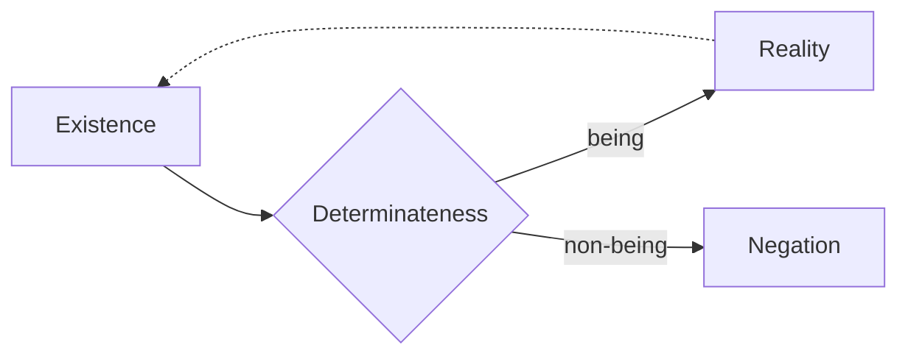

## The Development of Quality

> On account of the immediacy with which being and nothing are one in existence,
> neither oversteps the other; to the extent that existence is existent, to that
> extent it is non-being; it is determined. Being is not the _universal_,
> determinateness not the _particular_. Determinateness _has yet to detach
> itself_ from _being_; nor will it ever detach itself from it, since the now
> underlying truth is the unity of non-being with being; all further
> determinations will transpire on this basis. But the connection which
> determinateness now has with being is one of the immediate unity of the two,
> so that as yet no differentiation between the two is posited (Hegel 2010,
> 84-85/21.98).

When `existence` is regarded in its immediacy, the unity of `being` and
`non-being` is understood in a simple oneness. However, this simple immediacy is
next undermined by the fact that existence is not merely immediate but is
specifically _existing_&mdash;phrased somewhat terse by Hegel as "the extent
that existence is existent". What should be understood is that the transition
here is instant: going from the element of immediacy (`being`) to its vanishing
(`non-being`). However, in contrast to `pure being`, `existence` as a concept
does not cease at its `non-being`. In fact, if Hegel is right, that is where it
_begins_.

Hegel warns that `being` is not to be understood as a universal with
determinateness as a particular, which could suggest that being is a generic
genus of which determinateness is a particular species. This would suggest that
there could be `being` in some general form, which sometimes is counted as
determined and sometimes not. No further speculations about the nature of
undetermined `being` is necessary, since that was scrutinized
[earlier in the _Logic_](/articles/hegel/reference/being/development) and proved
to be determinate.

Determinateness, or what a being specifically is, cannot be set apart from
`being`. The implication discovered
[previously](/articles/hegel/reference/becoming/development) is that `being` and
`non-being` are logically intertwined, yet it is when the former sublates itself
that it becomes evident _how_ being is _specifically_, namely, what it is _not_.
The case in point here is simply that `being` is _not_ `nothing`&mdash;in order
to conceptualize this, `nothing` must be connected to `being`, however, not as
sheer `nothing` but as the point where `being` ceases or where `being` is
`non-being`. Said otherwise, `nothing` as the point at which `being` ceases
(vanishes) _is_ `non-being` insofar as this is understood to be _connected_ to
`being` as such. As [noted](/articles/hegel/reference/existence/development),
this conceptualization is no longer pure `being` but `existence`.

> Determinateness thus isolated by itself, as _existent_ determinateness, is
> _quality_ – something totally simple, immediate. _Determinateness_ in general
> is the more universal which, further determined, can be something quantitative
> as well. On account of this simplicity, there is nothing further to say about
> quality as such (Hegel 2010, 85/21.98).

In elaborating this connection of `being` and `non-being`, it is made explicit
how a new determinateness is at play, indeed, this determinateness is `quality`.
For now, this determinateness is merely something simple and immediate. However,
based on the development thus far, it is implied that it renders how an existent
negotiates `being` and `non-being` depending on whether the existent is
explicitly regarded in the register of `being` _or_ `non-being`.

> Existence, however, in which nothing and being are equally contained, is
> itself the measure of the one-sidedness of quality as an only _immediate_ or
> _existent_ determinateness. Quality is equally to be posited in the
> determination of nothing, and the result is that the immediate or existent
> determinateness is posited as distinct, reflected, and the nothing, as thus
> the determinate element of determinateness, will equally be something
> reflected, a _negation_. Quality, in the distinct value of _existent_, is
> _reality_; when affected by a negating, it is _negation_ in general, still a
> quality but one that counts as a lack and is further determined as limit,
> restriction (Hegel 2010, 85/21.98-99).

In the first case, insofar as `existence` is regarded immediately, it falls
under `quality` in its one-sidedness where determinateness is simply existent.
This is positing `quality` in the determination of `being`. Equally, `quality`
must be posited in the determination of `nothing`.

Positing in the determination of `nothing` brings immediacy to its mediation, or
`being` to its `non-being`. Insofar as this is done, `being` is rendered a
distinct moment alongside `non-being`. The determining of these as _distinct
moments_ forks `quality` into two variants: `reality` and `negation`.

> Both are an existence, but in _reality_, as quality with the accent on being
> an existent, that it is determinateness and hence also negation is concealed;
> reality only has, therefore, the value of something positive from which
> negating, restriction, lack, are excluded. Negation, for its part, taken as
> mere lack, would be what nothing is; but it is an existence, a quality, only
> determined with a non-being (Hegel 2010, 85/21.99).

