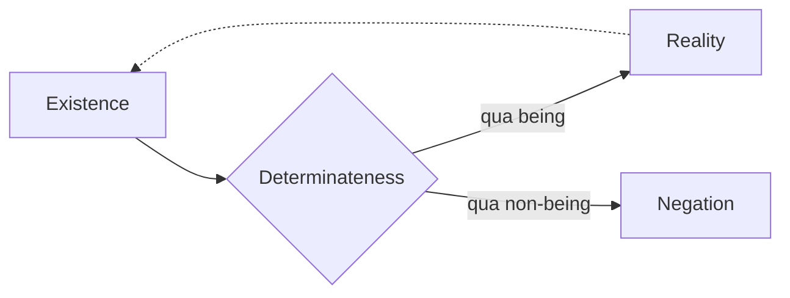

## The Development of Quality

### Determinateness and Being

> On account of the immediacy with which being and nothing are one in existence,
> neither oversteps the other; to the extent that existence is existent, to that
> extent it is non-being; it is determined. Being is not the _universal_,
> determinateness not the _particular_. Determinateness _has yet to detach
> itself_ from _being_; nor will it ever detach itself from it, since the now
> underlying truth is the unity of non-being with being; all further
> determinations will transpire on this basis. But the connection which
> determinateness now has with being is one of the immediate unity of the two,
> so that as yet no differentiation between the two is posited (Hegel 2010,
> 84-85/21.98).

When `existence` is regarded in its immediacy, the unity of `being` and
`non-being` is understood in a simple oneness. However, this simple immediacy is
next undermined by the fact that existence is not merely immediate but is
specifically _existing_&mdash;phrased somewhat terse by Hegel as "the extent
that existence is existent". What should be understood is that the transition
here is instant: going from the element of immediacy (`being`) to its vanishing
(`non-being`). However, in contrast to `pure being`, `existence` as a concept
does not cease at its `non-being`. In fact, if Hegel is right, that is where it
_begins_.

Hegel warns that `being` is not to be understood as a universal with
determinateness as a particular, which could suggest that being is a generic
genus of which determinateness is a particular species. This would suggest that
there could be `being` in some general form, which sometimes is counted as
determined and sometimes not. No further speculations about the nature of
undetermined `being` is necessary, since that was scrutinized
[earlier in the _Logic_](/articles/hegel/reference/being/development) and proved
to be determinate.

Determinateness, or what a being specifically is, cannot be set apart from
`being`. The implication discovered
[previously](/articles/hegel/reference/becoming/development) is that `being` and
`non-being` are logically intertwined, yet it is when the former sublates itself
that it becomes evident _how_ being is _specifically_, namely, what it is _not_.
The case in point here is simply that `being` is _not_ `nothing`&mdash;in order
to conceptualize this, `nothing` must be connected to `being`, however, not as
sheer `nothing` but as the point where `being` ceases or where `being` is
`non-being`. Said otherwise, `nothing` as the point at which `being` ceases
(vanishes) _is_ `non-being` insofar as this is understood to be _connected_ to
`being` as such. As [noted](/articles/hegel/reference/existence/development),
this conceptualization is no longer pure `being` but `existence`.

### The Birth of Quality: Reality and Negation

> Determinateness thus isolated by itself, as _existent_ determinateness, is
> _quality_ – something totally simple, immediate. _Determinateness_ in general
> is the more universal which, further determined, can be something quantitative
> as well. On account of this simplicity, there is nothing further to say about
> quality as such (Hegel 2010, 85/21.98).

In elaborating this connection of `being` and `non-being`, it is made explicit
how a new category is at play, indeed, this determinateness is determinateness
itself: `quality`. For now, this determinateness is merely something simple and
immediate. However, based on the development thus far, it is implied that it
renders how an existent negotiates `being` and `non-being` depending on whether
the existent is explicitly regarded in the register of `being` _or_ `non-being`.

> Existence, however, in which nothing and being are equally contained, is
> itself the measure of the one-sidedness of quality as an only _immediate_ or
> _existent_ determinateness. Quality is equally to be posited in the
> determination of nothing, and the result is that the immediate or existent
> determinateness is posited as distinct, reflected, and the nothing, as thus
> the determinate element of determinateness, will equally be something
> reflected, a _negation_. Quality, in the distinct value of _existent_, is
> _reality_; when affected by a negating, it is _negation_ in general, still a
> quality but one that counts as a lack and is further determined as limit,
> restriction (Hegel 2010, 85/21.98-99).

Here Hegel points out that `existence` is the _measure_ of the one-sidedness of
quality. When `existence` is merely grasped immediately, this one-sidedness is
an external reflection. However, in `quality` the one-sidedness is made inherent
in the category itself. Following this, insofar as `existence` is regarded
immediately, it falls under `quality` in its one-sidedness where determinateness
is simply existent. This is positing `quality` in the determination of `being`.
Equally, `quality` must be posited in the determination of `nothing`.

Positing in the determination of `nothing` brings immediacy to its mediation, or
`being` to its `non-being`. Insofar as this is done, `being` is rendered a
distinct moment alongside `non-being`. The determining of these as _distinct
moments_ forks `quality` into two variants: `reality` and `negation`.

> Both are an existence, but in _reality_, as quality with the accent on being
> an existent, that it is determinateness and hence also negation is concealed;
> reality only has, therefore, the value of something positive from which
> negating, restriction, lack, are excluded. Negation, for its part, taken as
> mere lack, would be what nothing is; but it is an existence, a quality, only
> determined with a non-being (Hegel 2010, 85/21.99).

While the development of `quality` stems from the explication of the connection
of `being` and `non-being`, its more determined forms `reality` and `negation`
emphasize their respective ends of the connection. On the one hand, it is
`being` _with_ `non-being`, and in the other, it is `non-being` _with_ `being`.
This emphasis actually serves to conceal the other end. For example, determining
something as real emphasizes its `being` and conceals the implied connection to
`non-being` and `negation`. This matches the prior development at the
[start](/articles/hegel/reference/existence/development) where `existence` is
actually only regarded in its `reality`, that is, immediate being, with its
`negation` concealed.

`Negation`, however, while emphasizing its respective end of `non-being`,
appears to imply `being` in a stronger sense than `reality`, since nothing less
than an existent can be negated. Whereas an existent can be real with only an
implied reference to its `non-being`. This creates an asymmetrical relationship
between the two categories.

`Quality` thus establishes that `existence`, owing precisely to its unity of
_two_, must come in two forms: `reality` is the qualitative determinateness with
the accent on `being` in the connection whereas `negation` is the qualitative
determinateness with the accent on `non-being`. The previous perfect coinciding
of `being` and `non-being` in `existence` as it was first presented is now
regarded as _one_ of its forms, namely, in its `reality`.

TODO - add an concluding implications section

## Further Commentary

### Houlgate

Stephen Houlgate writes that _Dasein_ (`existence`) is not to be thought of as a
"subject" that "has" qualities, on the contrary, he writes, "_Dasein_ is one
with &ndash; indeed, identical to &ndash; quality itself" (Houlgate 2022, 161).
Quality makes being determinate and being is determinate insofar as it is
qualitative. He notes that it is tempting to think of `quality` as a property
that belongs to something; however&mdash;and this is part of what makes
speculative logic challenging&mdash;Hegel's account conceives of `quality`
_without_ that notion that it belongs to "something". Instead, `quality` is
regarded entirely on its own as a consequence of how speculative
presuppositionless logic proceeds, namely, from indeterminate `being` (through
`nothing` and `becoming`) to determinate `existence`.

Houlgate poses the question why the one-sidedness of `being` is valid in
`quality` but not in `existence` as such? The reason is that `non-being` is in
`existence` merely implicit whereas it comes explicitly to the fore in `quality`
since the latter is a further form of determinacy or `non-being`.

> The moment of non-being is thus explicitly to the fore in quality in a way it
> is not in _Dasein_ by itself. Yet quality is determinacy, or non-being, “in
> the form of _being_” (_als seiende_) (Hegel 2010, 84/21.98). There is thus an
> explicit tension in it that is absent from _Dasein_ as it is first conceived:
> quality is _non_-being, but in the form of _being_ rather than non-being
> itself. As such, quality is non-being that fails to do justice to its own
> negative character. Accordingly, the judgement that it is “one-sided” is not
> merely an external reflection, but is grounded in its explicit logical
> structure. Strictly speaking, therefore, it is not just _Dasein_ in general,
> but _quality_ itself, that contains the criterion for the one-sidedness of
> quality (Houlgate 2022, 162).

This observation shows that, firstly, quality fails to be fully `non-being` (or
that `non-being` fails to be fully itself) since it is `non-being` _in_ the form
of `being`. Roughly speaking, it is a negative element in a positive one.
Secondly, the one-sidedness stems from exactly this split within `quality`; its
inability to cohere fully with its negative characters has left a distance or
rift, so to speak, between its `being` and determinateness, or its presentation
and its meaning. One might say that `quality` not only is the birth of
determinateness but also of one-sidedness: the notion that something is being
omitted, indeed, _the_ negative itself within the negative.[^1] Thirdly, then,
it becomes clear that a tension exists in `quality` that was not apparent in
`existence` as such.

[^1]:
    In a twisted sense, the negative is negative even with respect to itself,
    such that it fails to be negative as negative. And precisely because of
    this, it succeeds (Niklas).

Houlgate traces carefully the development of `negation` and `reality`. First,
once `quality` is understood to be not only `non-being` in the form of `being`
but `being` _in_ the form of `non-being`, it becomes fully and explicitly
negative: `negation`. He stresses that the category of `negation` arises at this
point in the logical development because thought simply renders explicit what is
implicit in the conception of quality itself. "The derivation of negation is
thus wholly immanent in Hegel's distinctive sense" (Houlgate 2022, 162).

Second, once it is then understood that `quality` differentiates _itself_ from
simple, immediate quality&mdash;which is determinacy _in the form of being_
(akin to `existence`)&mdash;in the negative element of `negation`. This simple
and immediate quality takes on an affirmative quality _in contrast_ to the
negative quality. This one-sided affirmative quality is named `reality`.

`Reality` and `negation` are not merely different moments of quality. The
moments of quality are logically `non-being` and `being`, which both `reality`
and `negation` are. However, what sets them apart is the different stress or
accent (_Akzent_). They are both `quality` but with the emphasis put more on
either immediate `being` or mediated `non-being`.

For many philosophers, writes Houlgate, all qualities are real while negation is
the absence of a quality. In Hegel, however, negation is _likewise_ a quality:
negation is the quality of _not_ being so and so. "Determinate being contains
non-being and is thus identical with quality; quality in turn, _as_ non-being in
the form of being, cannot just be affirmative but must also be negative; it
must, therefore, take the twin forms of reality _and_ negation" (Houlgate 2022,
163). `Negation` therefore is just as much part of `existence` (determinate
being) as `reality`, since it is seen that `existence` is not simply `being`
_but also_ `non-being`.

But does this account of quality and negation not lead to the idea that
everything has a infinite number of quality, each of which is _not_ being
another thing? Houlgate answers that this cannot be the case because there are,
at this stage of the logic, no "things" in relation to other "things", much less
an infinity of them. "All Hegel has demonstrated so far is the general
proposition that quality is both negative and affirmative, and that,
accordingly, negation belongs to determinate being as much as reality does"
(Houlgate 2022, 163). Houlgate's conclusion is that all that is the case right
now is `existence` and its twin forms of `reality` and `negation`; it has not
been shown how existents would relate vis-à-vis one another, much less the idea
of _an_ existent as something self-contained.
