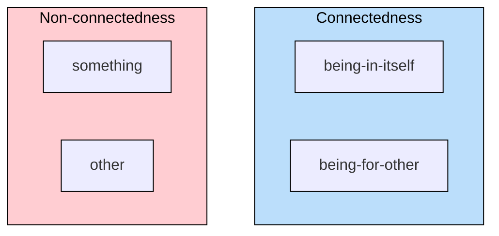
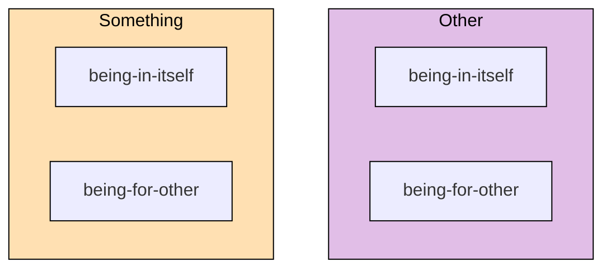
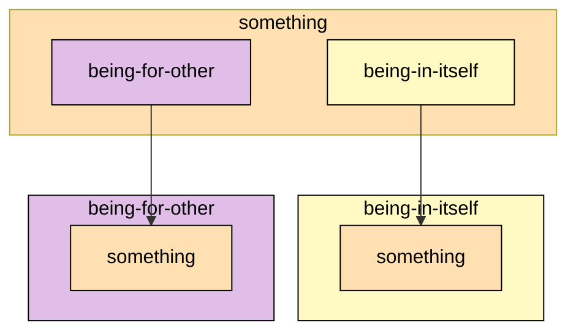

## The Development of Something and Other

### The Other

`Other` is first determined at the end of the
[the development of `something`](/articles/hegel/reference/something/development)
and the two now form a pair that progress the logic further. Before looking at
that development, however, a semantic issue needs to be settled: is an `other`
actually a category in its own right and not merely a reflection of `something`?

Both `something` and `other` are each determined as
[`existents`](/articles/hegel/reference/existence/development) as well as
`something` in its own right. An `other` is just as much a `something` in its
own right. Their difference may appear to be merely semantic, such as a sentence
ordering&mdash;for example, this bulletin is different from that other
one&mdash;such that `something` and `other` are essentially the _same_ (see
Hegel 2010, 90-91/21.105-106). Hegel, however, claims that there is a logical
difference between the two determinations, and that the `other` is a particular
determination in its own right: "_other_, as posited at first, though an other
with reference to something, is other also _for itself apart from the
something_" (Hegel 2010, 91/21.106).

Hegel illustrates this in the common usage of nature, particularly as it is
regarded as _other_ of human self-conscious activity or _spirit_. At first, the
determinateness of nature expresses a mere relativity&mdash;a _something
different_ from the matter at hand&mdash;but what is implied in this is not that
the externality of nature merely exists within self-conscious thought as such,
but that externality is a quality of nature itself: "taken for itself the
quality of nature is just this, to be the other within, that
_which-exists-outside-itself_" (Hegel 2010, 92/21.106).

Coincidentally, the term nature encompasses its own set of concepts which are
each determined and developed through the primitives of space, time and
matter&mdash;categories which are precisely further concrete elaborations on the
theme of _that which-exists-outside-itself_. It is important to remember,
however, that while nature may exemplify the idea of the `other`, the concept of
the `other` does not logically depend on nature; one does not need to appeal to
nature in order to conceptualize otherness. Hegel develops this concept of the
`other` entirely out of the concept of `something`, immanently.

While it is not yet clear why `other` is a category distinct from `something`, a
couple of clues may act as helpful stepping stones towards that understanding.
First, there _is_ a distinction to be made between a `something` that entirely
and immanently develops from pure `being` and the `something` that _is_ as the
result of an _other_ `something`. Second, the distinction between an immediate
`something` and a mediated `something` holds&mdash;or, does not
collapse&mdash;because the quality of being `something` means to have a
`being-within-itself` or an _internality_, such that the two `somethings` cannot
collapse into one. Instead, the two `somethings` must form a new difference
_vis-á-vis_ one another. Additionally, this new difference cannot be relational
or a concrete unity, since that would require a third element to bind the other
two, which would be presupposing too much. Rather, the difference must be
contained within each `something`, perhaps as the feature of being `something`.

### The Other of the Other

> The other which is such for itself is the other within it, hence the other of
> itself and so the other of the other &ndash; therefore, the absolutely unequal
> in itself, that which negates itself, _alters_ itself. But it equally remains
> identical with itself, for that into which it alters is the _other_, and this
> other has no additional determination; but that which alters itself is not
> determined in any other way than in this, to be an other; in _going over_ to
> this other, it _only unites with itself_. It is thus posited as reflected into
> itself with sublation of the otherness, a self-_identical_ something from
> which the otherness, which is at the same time a moment of it, is therefore
> distinct, itself not appertaining to it as something (Hegel 2010, 92/21.106).

Not only is the `other` a determinateness that applies with regards to
`something`, two `somethings` (non-quantitatively) or `something` and `other`,
but it also applies to the `other` as such. This yields the peculiar notion that
an `other` is an `other` to itself. To phrase this using a different term:
externality is external to itself.

This conception of `the other of the other` produces two absolutely contrary
determinations. First, by virtue of being `_other_`, the inner `other` is
completely unequal to the outer `other`, and since this determination _is_
within the `other`, it essentially negates itself or, as Hegel puts it, _alters_
(_verändert_) itself. Second, by the same token, the inner `other` is perfectly
identical to the outer `other` since they are both equally `other`, such that
the `other` thereby rejoins itself as it is. This movement of "othering" servers
to change the `other` but what it changes into is nothing else than `other`
again.

```md
but that which alters itself is not determined in any other way than in this, to
be an other; in going over to this other, it only unites with itself.
```

The first instinct might be to conclude that no change took place in this
"othering". But reading Hegel carefully, it is understood that the first
determination of `the other of the other`&mdash;that the inner and outer `other`
_are_ unequal&mdash;does in fact take place without reference to the second. The
first determination thus is not dependent on the second for its validity, and so
the second does not have the authority to revoke the determination of the first.
Granted that the `other` _is_ `other` to itself, the second determination
necessarily follows from the first.

The second determination&mdash;that the inner and outer `other` _are_
equal&mdash;does also in fact run completely counter to the first. It really
does appear that a contradiction follows from `the other of the other`; but this
precisely displays the _movement_ of change itself whereby an element of
difference _and_ identity are necessarily both contained. In everyday parlance,
this is readily grasped and accepted: it does not make sense to say a matter has
changed if there is not some unity between its two states, but likewise it does
not make more sense to say that there is no difference, since then there would
be no different states to speak of. Change, it seems, must incorporate these two
elements. What Hegel shows here is how change minimally develops from the
"inside-out", as it were, by thinking what logically follows from the idea of
`other` when the category is turned upon itself.

### Being-for-other

> The something _preserves_ itself in its non-being; it is essentially _one_
> with it, and essentially _not one_ with it. It therefore stands in _reference_
> to an otherness without being just this otherness. The otherness is at once
> contained in it and yet _separated_ from it; it is _being-for-other_ (Hegel
> 2010, 92/21.106).

`Being-for-other` (_Sein-für-Anderes_) determines the state of `something`
whereby it is connected to an `other` while also _not merely being_ this
`other`. One might say it is the "outward facing aspect" of `something`. This
"aspect", however, is internally part of what it means to be `something` such
that it is not a determination externally imputed upon a `something`. It follows
from the nature of `something` that it _has_ a `being-for-other`.

> Existence as such is an immediate, bare of references; or, it is in the
> determination of _being_. However, as including non-being within itself,
> existence is _determinate_ being, being negated within itself, and then in the
> first instance an other &ndash; but, since in being negated it preserves
> itself at the same time, it is only _being-for-other_ (Hegel 2010, 92/21.106).

Hegel elaborates further on this concept by looking briefly back at the
development from [`existence`](/articles/hegel/reference/existence/development).
First, `existence` is determinacy that is maximally immediate or is in
considered first and foremost in its `being`. It is not absolutely immediate
since that is what pure [`being`](/articles/hegel/reference/being/development)
is, but maximally immediate in terms of what a being that is determinate.
Second, with the growing emphasis on `non-being` that is necessarily part of
`existence`, it is qualified as _determinate being_. Third, it is seen how this
negative element forms a `negation` within itself insofar as it is regarded as a
being whose determinacy is its own as `something`. Fourth, this `something` is
an `other`. Fifth, and consequently the present situation, this `other` is
negated (though the `other of the other`) but in such a way that preserves its
being _as_ `other`. The `other` here ceases to be _merely_ `other` and gains a
being that is "other-for-something", or, as Hegel terms it, `being-for-other`.

In `being-for-other`, the determination of `something` is brought right back
into play but in terms of the `other`. Put differently, determining something as
`being-for-other` means that it has an existence that is _for_ `other` in the
double sense that it is, first, _for_ "otherness" as such, and, second, that it
is _for_ an _other_ `something`.

To illustrate, saying that the green apple appears in a certain way for me in
such and such way is really mostly in part due to the human visual field with
its particular sensitivity of the light spectrum etc., such that this
determinacy from the standpoint of the apple belongs to the `other`, i.e., to
the human observer. For another observer, the apply might look very differently!
However, this other perspective cannot be wholly divorced from the apple in
question. It really belongs to the apple, at least conceptually, to be
determined in this way and picked up by an other, such that not everything about
its determining as it appears for me is exclusive only to me (lest it be a
hallucination &ndash; but then where did the first determinacy emerge from?).

### Being-in-itself

> It preserves itself in its non-being and is being; not, however, being in
> general but being with reference to itself _in contrast_ to its reference to
> the other, as self-equality in contrast to its inequality. Such a being is
> _being-in-itself_ (Hegel 2010, 92/21.107).

`Being-in-itself` (_Ansichsein_) is defined in contrast to `being-for-other`.
Importantly, `being-in-itself` is _not_ the immediacy of `something` or its
"native" determinacy, but is specifically the determination that defines what
belongs to `something` _against_ the `other`. Where the `being-for-other`
specifies what is open to the `other`, `being-in-itself`, by contrast, specifies
what is closed to the `other` since it picks out what _really_ belongs to the
`something` in question. Where `being-for-other` brings an unequal level of
determinacy into `something`&mdash;this `something` can be viewed in a plurality
of different ways according to the eye of the beholder, as it
were&mdash;`being-in-itself` clears the determinacy to be only what _genuinely_
forms part of this `something` _against_ the other.

Take, for example, the idea that a stone has a certain hardness. This quality,
however, only makes sense from the perspective of someone who can touch and
compare it to other things. For the stone _in itself_, there is no "hard" or
"soft"&mdash;only a certain resistance to being scratched or dented.

### Being-for-other and Being-in-itself

> Being-for-other and being-in-itself constitute the _two moments_ of something.
> There are here _two pairs_ of determinations: (1) _something_ and _other_; (2)
> _being-for-other_ and _being-in-itself_. The former contain the
> non-connectedness of their determinateness; something and other fall apart.
> But their truth is their connection; being-for-other and being-in-itself are
> therefore the same determinations posited as _moments_ of one and the same
> unity, as determinations which are connections and which, in their unity,
> remain in the unity of existence. Each thus itself contains within it, at the
> same time, also the moment diverse from it (Hegel 2010, 92/21.107).

Two pairs of determinations are at hand. The first designates the
non-connectedness of `something` and `other`. `Something` is only an `other`
_implicitly_, but _explicitly_ it is in itself just `something` (and vice versa
that `other` is implicitly a `something`). By spelling out this difference in
terms of implied and explicit, the connection between these two categories
becomes visible, such that the terms `something` and `other` are not sufficient
alone to determine their connection.



The second pair, then, designates the connectedness of `something` and `other`.
Specifically how each form moments of the same individual unity, namely, that
the same `something` is _also_ an `other` (and vice versa). The inwardness and
"selfsameness" of `something` is recast as `being-in-itself`, designating that
which holds its own and refers to itself. Conversely, the outward and
self-negating dimension of the `other`, is established as `being-for-other`. The
connection is made emphatic by the fact that the both terms employ `being` as
the initial ground that diffracts into its "_for-otherness_" and
"_in-itselfness_", thus rendering each as moments of the same entity.

The extreme point of unity in the pair `being-for-other` and `being-in-itself`
is just `existence` once more, since the logic cannot collapse further back than
the category where at least two elements must co-exist (hence `existence`). But
this point of unity is not really collapsed into since `being-for-other` and
`being-in-itself` form a pair with `something` and `other` whereby each contains
itself _and its other_.



`Being-in-itself` and `being-for-other` are determinations of
`something`-and-`other` that emphasize their connection. However, these two
determinations mirror each other in a peculiar way.

> ... _being-in-itself_ is, first, negative reference to non-existence; it has
> otherness outside it and is opposed to it; in so far as something is _in
> itself_, it is withdrawn from being-other and being-for-other. But, second, it
> has non-being also right in it; for it _is_ itself _the non-being_ of
> being-for-other (Hegel 2010, 93/21.108).

Hegel points out that while `being-in-itself` excludes `being-for-other`, it
nonetheless refers to it&mdash;one might say, presupposes it. But Hegel goes one
step further and states that it _is_ the `non-being` of `being-for-other`. This
tight coupling of `being` and `non-being` is reminiscent of `existence` where
these two form a oneness.

A similar situation seems to be the case for `being-for-other`:

> But being-for-other is, first, the negation of the simple reference of being
> to itself which, in the first place, is supposed to be existence and
> something; in so far as something is in an other or for an other, it lacks a
> being of its own. But, second, it is not non-existence as pure nothing; it is
> non-existence that points to being-in-itself as its being reflected into
> itself, just as conversely the being-in-itself points to being-for-other
> (Hegel 2010, 93/21.108).

The connectedness and mutual reference of `being-for-other` and
`being-in-itself` shows that neither _exists_ without the other. There is no
`being-for-other` that is _purely for other_, since the `being` it is sourced
from is its own "othering". The same conclusion applies to `being-in-itself`,
where there is no inward being which does not also determine an outward being.

These conclusions may appear uncontroversial and innocent enough, but when
turning to a more concrete reality, one often employs one without the other. One
imagines that one's inner life of emotions and feelings is entirely
private&mdash;merely `being-in-itself`&mdash;but these invariably have an
outward manifestation. Or that there is an absolute law of nature that merely
exists in itself without reference to its expression in things. Or, conversely,
that one can put up a certain manner of being pretending that is not who one is,
for example, "this job is not who I am, it is only something I do while I wait
for better things" or "I only do this to be nice to you, but it is not who I
am". Or that money only has an apparent, illusory value but no intrinsic value
whatsoever. If Hegel is right, there really is no `being-in-itself` that does
not also have a `being-for-other` and vice versa. The two point to one and the
same concept.

Looking back at the development of the _Logic_, `pure being` has failed to be in
its sheer immediacy. Instead, being exists in _being determinate_. This
determinacy has now evolved to the point where it subsists as _self-referring
being_ or `something`. But this self-reference precisely _excludes_ the `other`,
rendering `something` in more precise terms as `being-in-itself`&mdash;the
`being` that refers to itself through excluding `non-being`. But determinacy
requires the element of `non-being` as a moment of the self-referring being.
Indeed, where `pure being` fails _to be_, `something` succeeds by its ability to
refer to itself _by excluding_&mdash;or `negating`&mdash;`non-being` from
itself. This exclusion _is_ the `being-for-other` that opens up the
`something`'s `being-in-itself`. This concept applies no less to the entire
logic itself up to this point. In other words, logic has a `being-in-itself`
that _is_ its own&mdash;it does not belong to any one human language, individual
thought or symbolic expression&mdash;but it _has a_ being that is presentable
through all languages, thoughts and expressions&mdash;but the conclusion forces
us to recognize that logic is only meaningful, paradoxically, in being negated.

### Something Undivided

> Both moments are determinations of one and the same, namely of something.
> Something is _in-itself_ in so far as it has returned from the being-for-other
> back to itself. But something has also a determination or circumstance,
> whether _in itself_ [_an sich_] (here the accent is on the _in_) or _in it_ >
> [_an ihm_]; in so far as this circumstance is _in it_ [_an ihm_] externally,
> it is a being-for-other (Hegel 2010, 93/21.108).

Hegel here differentiates between, on the one hand, what something is in itself,
without relation to anything else, and, on the other hand, something happening
on or with respect to a specific thing. For example, Kant's notion of _Das Ding
an sich_ (the thing in itself), designates the thing that is beyond our
perception, merely as it is in itself. Conversely, _man kann das an ihm
erkennen_ (you can recognize that in him&mdash;or on him), points to something
related to or happening with a particular thing&mdash;`something` _in_ an
`other`.

> This leads to a further determination. _Being-in-itself_ and being-for-other
> are different at first. But that something also has _in it what it is in
> itself_ and conversely is in itself also what it is as being-for-other &mdash;
> this is the identity of being-in-itself and being-for-other, in accordance
> with the determination that the something is itself one and the same something
> of both moments, and these are in it, therefore, undivided (Hegel 2010,
> 93/21.108).

It was understood earlier that `being-in-itself` and `being-for-other` form part
of the same `something`. Here Hegel emphasizes the point through the double
meaning of _in it_ (_an sich_ and _an ihm_) which inheres in both
determinations: First, _in it_ (_an sich_) in the absolute sense signifies the
`being-in-itself` of `something`&mdash;its own _closed_ interior and exclusive
ownership. Second, _in it_ (_an ihm_) in the relative sense signifies the
`being-for-other` of `something`&mdash;the determination of it _open_ to others
and, one might say, shared ownership. However, both terms are determinations of
the same `something` or, by happy coincidence of language, share the same _in
it_, and in that respect the same `something` inheres in both.



By virtue of this identity, what first appeared as different terms are in fact
the same.

> In the unity of the something with itself, _being-for-other_ is identical with
> its _in-itself_; the being-for-other is thus _in_ the something. The
> determinateness thus reflected into itself is therefore again _a simple_
> existent and hence again a quality &ndash; _determination_ (Hegel 2010,
> 95/21.110).

Once it is understood that `being-in-itself` and `being-for-other` are of the
same `something`&mdash;here `something` is regarded in its self-reference, or
"unity with itself"&mdash;the terms converge since `being-for-other` does not
exist apart from `something` but is immanent to it, and in that regard, it is
equally its `being-in-itself`. Likewise, `being-in-itself` must also be an
"expression" of `something` inasmuch as the interiority is distinguished
vis-à-vis exteriority; but this expression precisely determined what belongs to
the `something` in question, and so the determinateness of the exterior here is
nothing separate from the interior and the two once more converge. In other
words, insofar as `something` is concerned in pure terms of `being-in-itself`
and `being-for-other`, the exterior _is_ the interior and vice versa.

### Reciprocal Determination? (Niklas)

By virtue of the identity in `something`, `being-in-itself` and
`being-for-other` are different expressions of the same. However, Hegel's
transition may not be entirely exhaustive, since there remains the logical
possibility that these terms reciprocally determine one another which may yield
a different dialectical outcome.

First, it must be established that `something` in the development of the _Logic_
proves have determinations that are expressed to others. Indeed, these
determinations that are expressed to other are integral to the `something`
actually having determinations of its own. Hegel criticizes Kant's notion of a
`thing-in-itself` since it stipulates a `something` that has no such expressed
determinations, which is incoherent.

> Things are called “in-themselves” in so far as abstraction is made from all
> being-for-other, which really means, in so far as they are thought without all
> determination, as nothing. In this sense, of course, it is impossible to know
> _what_ the thing-in-itself is. For the question “_what?_” calls for
> determinations to be produced; but since the things of which the
> determinations are called for are at the same time presumed to be
> _things-in-themselves_, which means precisely without determination, the
> impossibility of an answer is thoughtlessly implanted in the question, or else
> a senseless answer is given (Hegel 2010, 94/21.109).

Therefore, `something` must have `being-for-other`. `Something` is a form of
determinate being that not only specifies what determinacy minimally is, but
what determinacy must minimally be _in order to make available to others what
really belongs to it_, i.e. a determinacy that is split between its
`being-in-itself` and `being-for-other`.

So, with the identity of the terms in mind, one can take it further since
`being-in-itself` and `being-for-other` _reciprocally_ determine one another
insofar as each is a `being-in-itself` of the same `something` in forming
moments of it, and, likewise, each is an expression, a `being-for-other`, of the
same `something` insofar as they make available a determination of that
`something`. Thus, both `being-in-itself` and `being-for-other` take turns, as
it were, in being for another and being in itself for the being that has any
determinations of its own. This does not, however, appear develop any new
results, but repeats the pattern already established. If anything, it reinforces
the identity of the terms such that neither can be the sole context of both
itself and the other; such that a further determination lies at the seams.

The implications of this is not that `being-in-itself` and `being-for-other` are
untrue or erroneous. However, they _are_ erroneous if one is taken to be true
without the other, that is, if one is held to be true unconditionally and
absolutely. As Hegel shows in his critique of Kant, an incoherence exists
immediately in the idea of a `thing-in-itself`, since one stipulates `something`
that has no `being-for-other`, but this leaves out exactly the very
determination _thing-in-itself_, such that there exists at least one
determination, namely, the one that brings forth its `being-in-itself`.

## Further Commentary

### Houlgate

Stephen Houlgate emphasizes that while the term "other" has been used in the
_Logic_ up to this point, such as `being` and `nothing` each being unseparated
from its other, neither of these (nor `reality` or `negation`) are actually
`other` to each other. The `other`, Houlgate writes,

> is not just simple negation ... it is _self-relating_ negation. Unlike
> negation, therefore the other is not merely one side of a difference: it is
> not bound to something in the way negation is bound to reality. Rather, the
> other stands apart from something as something separate from it, as something
> of its own (Houlgate 2022, 177).

Like `reality` and `negation`, `something` and `other` co-exist while being
different, yet their difference is not merely two sides of the same difference
(moments of a difference) but are _self-relating_ distinctions. "Being _other_
than something thus consists in being separate from it, not in being its simple
negation" (Houlgate 2022, 177).

With regards to `something` and `other`as such, Houlgate notes that a certain
indeterminacy is at play. Neither is fixed as _this_ `something` and _not that_.
However, this indeterminacy is different from that of `being` and `nothing` as
`something` and `other` do not vanish into one another but each are, rather, the
other in being itself (see Houlgate 2022, 179).

However, a subtle shift has taken place. `Other` is a determination that not
only applies to the `other` but can equally apply to `something`. The
determination of `other` itself has become "alien" (_fremd_), belonging to
neither. Houlgate continues:

> This is because each is now a _something_ and is determined to be other only
> by the presence _outside_ it of its counterpart. Being other still means being
> a self- relating negation, that is, being the negation of something and yet
> standing apart from the latter as something in its own right. Now, however,
> neither of the somethings is intrinsically other, but each is other only
> because there is something for it to be other than. If, therefore, either
> &ndash; > _per impossibile_ &ndash; were to be all on its own, it would not be
> an _other_, but would simply be self-relating being, or something. It is only
> the presence of a second something that turns each _into_ an “other” (Houlgate
> 2022, 179).

This does not make `other` a contingent determination that `something` may or
may not exhibit, Houlgate adds, but the `other` follows logically from being
`something`. However, it is "only thanks to its other that something is an other
itself". As an aside, it does appear as if `other` is _qualified_ upon the
determination of the _second_ `something`. This aligns with Houlgate's
conclusion that it belongs to the very nature of `something` to be one of (at
least) two.

In the `other` relating negatively to itself, a new form of becoming
`becoming-other` is made explicit. This new becoming is more aptly understood as
_change_. Furthermore, it is discovered that this logical form of change does
[not presuppose time](/articles/hegel/reference/something-and-other/development).
