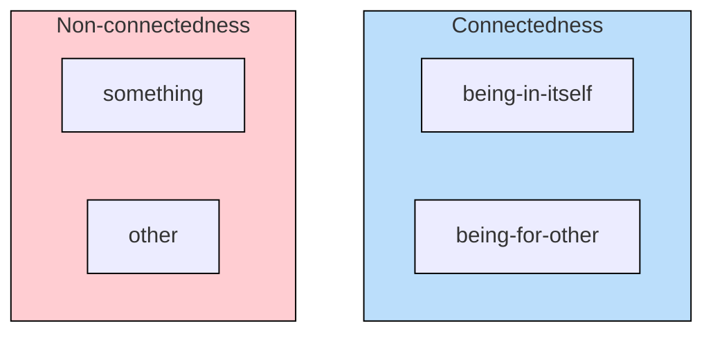
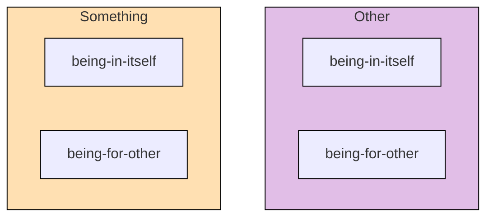

## The Development of Something and Other

### The Other

`Other` is first determined at the end of the
[the development of `something`](/articles/hegel/reference/something/development)
and the two now form a pair that progress the logic further. Before looking at
that development, however, a semantic issue needs to be settled: is an `other`
actually a category in its own right and not merely a reflection of `something`?

Both `something` and `other` are each determined as
[`existents`](/articles/hegel/reference/existence/development) as well as
`something` in its own right. An `other` is just as much a `something` in its
own right. Their difference may appear to be merely semantic, such as a sentence
ordering&mdash;for example, this bulletin is different from that other
one&mdash;such that `something` and `other` are essentially the _same_ (see
Hegel 2010, 90-91/21.105-106). Hegel, however, claims that there is a logical
difference between the two determinations, and that the `other` is a particular
determination in its own right: "_other_, as posited at first, though an other
with reference to something, is other also _for itself apart from the
something_" (Hegel 2010, 91/21.106).

Hegel illustrates this in the common usage of nature, particularly as it is
regarded as _other_ of human self-conscious activity or _spirit_. At first, the
determinateness of nature expresses a mere relativity&mdash;a _something
different_ from the matter at hand&mdash;but what is implied in this is not that
the externality of nature merely exists within self-conscious thought as such,
but that externality is a quality of nature itself: "taken for itself the
quality of nature is just this, to be the other within, that
_which-exists-outside-itself_" (Hegel 2010, 92/21.106).

Coincidentally, the term nature encompasses its own set of concepts which are
each determined and developed through the primitives of space, time and
matter&mdash;categories which are precisely further concrete elaborations on the
theme of _that which-exists-outside-itself_. It is important to remember,
however, that while nature may exemplify the idea of the `other`, the concept of
the `other` does not logically depend on nature; one does not need to appeal to
nature in order to conceptualize otherness. Hegel develops this concept of the
`other` entirely out of the concept of `something`, immanently.

While it is not yet clear why `other` is a category distinct from `something`, a
couple of clues may act as helpful stepping stones towards that understanding.
First, there _is_ a distinction to be made between a `something` that entirely
and immanently develops from pure `being` and the `something` that _is_ as the
result of an _other_ `something`. Second, the distinction between an immediate
`something` and a mediated `something` holds&mdash;or, does not
collapse&mdash;because the quality of being `something` means to have a
`being-within-itself` or an _internality_, such that the two `somethings` cannot
collapse into one. Instead, the two `somethings` must form a new difference
_vis-á-vis_ one another. Additionally, this new difference cannot be relational
or a concrete unity, since that would require a third element to bind the other
two, which would be presupposing too much. Rather, the difference must be
contained within each `something`, perhaps as the feature of being `something`.

### The Other of the Other

> The other which is such for itself is the other within it, hence the other of
> itself and so the other of the other &ndash; therefore, the absolutely unequal
> in itself, that which negates itself, _alters_ itself. But it equally remains
> identical with itself, for that into which it alters is the _other_, and this
> other has no additional determination; but that which alters itself is not
> determined in any other way than in this, to be an other; in _going over_ to
> this other, it _only unites with itself_. It is thus posited as reflected into
> itself with sublation of the otherness, a self-_identical_ something from
> which the otherness, which is at the same time a moment of it, is therefore
> distinct, itself not appertaining to it as something (Hegel 2010, 92/21.106).

Not only is the `other` a determinateness that applies with regards to
`something`, two `somethings` (non-quantitatively) or `something` and `other`,
but it also applies to the `other` as such. This yields the peculiar notion that
an `other` is an `other` to itself. To phrase this using a different term:
externality is external to itself.

This conception of `the other of the other` produces two absolutely contrary
determinations. First, by virtue of being `_other_`, the inner `other` is
completely unequal to the outer `other`, and since this determination _is_
within the `other`, it essentially negates itself or, as Hegel puts it, _alters_
(_verändert_) itself. Second, by the same token, the inner `other` is perfectly
identical to the outer `other` since they are both equally `other`, such that
the `other` thereby rejoins itself as it is. This movement of "othering" servers
to change the `other` but what it changes into is nothing else than `other`
again.

```md
but that which alters itself is not determined in any other way than in this, to
be an other; in going over to this other, it only unites with itself.
```

The first instinct might be to conclude that no change took place in this
"othering". But reading Hegel carefully, it is understood that the first
determination of `the other of the other`&mdash;that the inner and outer `other`
_are_ unequal&mdash;does in fact take place without reference to the second. The
first determination thus is not dependent on the second for its validity, and so
the second does not have the authority to revoke the determination of the first.
Granted that the `other` _is_ `other` to itself, the second determination
necessarily follows from the first.

The second determination&mdash;that the inner and outer `other` _are_
equal&mdash;does also in fact run completely counter to the first. It really
does appear that a contradiction follows from `the other of the other`; but this
precisely displays the _movement_ of change itself whereby an element of
difference _and_ identity are necessarily both contained. In everyday parlance,
this is readily grasped and accepted: it does not make sense to say a matter has
changed if there is not some unity between its two states, but likewise it does
not make more sense to say that there is no difference, since then there would
be no different states to speak of. Change, it seems, must incorporate these two
elements. What Hegel shows here is how change minimally develops from the
"inside-out", as it were, by thinking what logically follows from the idea of
`other` when the category is turned upon itself.

### Being-for-other

> The something _preserves_ itself in its non-being; it is essentially _one_
> with it, and essentially _not one_ with it. It therefore stands in _reference_
> to an otherness without being just this otherness. The otherness is at once
> contained in it and yet _separated_ from it; it is _being-for-other_ (Hegel
> 2010, 92/21.106).

`Being-for-other` (_Sein-für-Anderes_) determines the state of `something`
whereby it is connected to an `other` while also _not merely being_ this
`other`. One might say it is the "outward facing aspect" of `something`. This
"aspect", however, is internally part of what it means to be `something` such
that it is not a determination externally imputed upon a `something`. It follows
from the nature of `something` that it _has_ a `being-for-other`.

> Existence as such is an immediate, bare of references; or, it is in the
> determination of _being_. However, as including non-being within itself,
> existence is _determinate_ being, being negated within itself, and then in the
> first instance an other &ndash; but, since in being negated it preserves
> itself at the same time, it is only _being-for-other_ (Hegel 2010, 92/21.106).

Hegel elaborates further on this concept by looking briefly back at the
development from [`existence`](/articles/hegel/reference/existence/development).
First, `existence` is determinacy that is maximally immediate or is in
considered first and foremost in its `being`. It is not absolutely immediate
since that is what pure [`being`](/articles/hegel/reference/being/development)
is, but maximally immediate in terms of what a being that is determinate.
Second, with the growing emphasis on `non-being` that is necessarily part of
`existence`, it is qualified as _determinate being_. Third, it is seen how this
negative element forms a `negation` within itself insofar as it is regarded as a
being whose determinacy is its own as `something`. Fourth, this `something` is
an `other`. Fifth, and consequently the present situation, this `other` is
negated (though the `other of the other`) but in such a way that preserves its
being _as_ `other`. The `other` here ceases to be _merely_ `other` and gains a
being that is "other-for-something", or, as Hegel terms it, `being-for-other`.

In `being-for-other`, the determination of `something` is brought right back
into play but in terms of the `other`. Put differently, determining something as
`being-for-other` means that it has an existence that is _for_ `other` in the
double sense that it is, first, _for_ "otherness" as such, and, second, that it
is _for_ an _other_ `something`.

To illustrate, saying that the green apple appears in a certain way for me in
such and such way is really mostly in part due to the human visual field with
its particular sensitivity of the light spectrum etc., such that this
determinacy from the standpoint of the apple belongs to the `other`, i.e., to
the human observer. For another observer, the apply might look very differently!
However, this other perspective cannot be wholly divorced from the apple in
question. It really belongs to the apple, at least conceptually, to be
determined in this way and picked up by an other, such that not everything about
its determining as it appears for me is exclusive only to me (lest it be a
hallucination &ndash; but then where did the first determinacy emerge from?).

### Being-in-itself

> It preserves itself in its non-being and is being; not, however, being in
> general but being with reference to itself _in contrast_ to its reference to
> the other, as self-equality in contrast to its inequality. Such a being is
> _being-in-itself_ (Hegel 2010, 92/21.107).

`Being-in-itself` (_Ansichsein_) is defined in contrast to `being-for-other`.
Importantly, `being-in-itself` is _not_ the immediacy of `something` or its
"native" determinacy, but is specifically the determination that defines what
belongs to `something` _against_ the `other`. Where the `being-for-other`
specifies what is open to the `other`, `being-in-itself`, by contrast, specifies
what is closed to the `other` since it picks out what _really_ belongs to the
`something` in question. Where `being-for-other` brings an unequal level of
determinacy into `something`&mdash;this `something` can be viewed in a plurality
of different ways according to the eye of the beholder, as it
were&mdash;`being-in-itself` clears the determinacy to be only what _genuinely_
forms part of this `something` _against_ the other.

Take, for example, the idea that a stone has a certain hardness. This quality,
however, only makes sense from the perspective of someone who can touch and
compare it to other things. For the stone _in itself_, there is no "hard" or
"soft"&mdash;only a certain resistance to being scratched or dented.

### Being-for-other and Being-in-itself

> Being-for-other and being-in-itself constitute the _two moments_ of something.
> There are here _two pairs_ of determinations: (1) _something_ and _other_; (2)
> _being-for-other_ and _being-in-itself_. The former contain the
> non-connectedness of their determinateness; something and other fall apart.
> But their truth is their connection; being-for-other and being-in-itself are
> therefore the same determinations posited as _moments_ of one and the same
> unity, as determinations which are connections and which, in their unity,
> remain in the unity of existence. Each thus itself contains within it, at the
> same time, also the moment diverse from it (Hegel 2010, 92/21.107).

Two pairs of determinations are at hand. The first designates the
non-connectedness of `something` and `other`. `Something` is only an `other`
_implicitly_, but _explicitly_ it is in itself just `something` (and vice versa
that `other` is implicitly a `something`). By spelling out this difference in
terms of implied and explicit, the connection between these two categories
becomes visible, such that the terms `something` and `other` are not sufficient
alone to determine their connection.



The second pair, then, designates the connectedness of `something` and `other`.
Specifically how each form moments of the same individual unity, namely, that
the same `something` is _also_ an `other` (and vice versa). The inwardness and
"selfsameness" of `something` is recast as `being-in-itself`, designating that
which holds its own and refers to itself. Conversely, the outward and
self-negating dimension of the `other`, is established as `being-for-other`. The
connection is made emphatic by the fact that the both terms employ `being` as
the initial ground that diffracts into its "_for-otherness_" and
"_in-itselfness_", thus rendering each as moments of the same entity.

The extreme point of unity in the pair `being-for-other` and `being-in-itself`
is just `existence` once more, since the logic cannot collapse further back than
the category where at least two elements must co-exist (which is `existence`).
But this point of unity is not really collapsed into since `being-for-other` and
`being-in-itself` form a pair with `something` and `other` whereby each contains
itself _and its other_.


