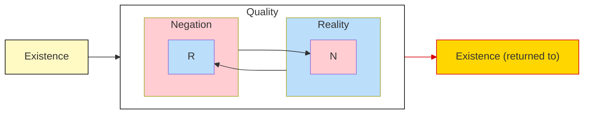

## The Development of Something

### Quality Undermines Itself

The category `something` (_Etwas_) develops out of
[`quality`](/articles/hegel/reference/quality/development), which itself
progressed from
[`existence` as such](/articles/hegel/reference/existence/development).

> In existence its determinateness has been distinguished as quality; in this
> quality as something existing, the distinction _exists_ &ndash; the
> distinction of reality and negation. Now though these distinctions are present
> in existence, they are just as much null and sublated. Reality itself contains
> negation; it is existence, not indeterminate or abstract being. Negation is
> for its part equally existence, not the supposed abstract nothing but posited
> here as it is in itself, as existent, as belonging to existence. Thus quality
> is in general unseparated from existence, and the latter is only determinate,
> qualitative being (Hegel 2010, 88/21.102-3).

`Quality` is the determinateness of `existence`. More specifically, `existence`
is either specified in terms of `reality` or `negation`. Crudely put, it signals
that which is real and that which is not there. Hegel emphasizes that
determinateness exists. It is not to be thought of as something separate from
existence or as that which lacks existence, since to qualify something as not
being there counts, in Hegel's eyes, as equally as qualifying something as being
real. Indeed, the two are logically inseparable.

```
Now though these distinctions are present in existence,
they are just as much null and sublated.
```

Hegel presses the idea that `reality` contains `negation` and vice versa, and in
so doing must designate them as sublated. Insofar as each is _contained_ in the
other, it has thereby rendered itself a moment of it. This signals that more is
at play than merely `reality` and `negation` since their mutual containment
points towards a higher context. Genealogically, their ancestor, so to speak, is
`existence` and so it would be their natural common identifier. However, it has
been discovered that this is essentially but one side of `quality`. The higher
context, therefore, must be that which contains both in their present
arrangement.

### Something Emerges

> This sublating of the distinction is more than the mere retraction and
> external re-omission of it, or a simple return to the simple beginning, to
> existence as such. The distinction cannot be left out, for it _is_. Therefore,
> what _de facto_ is at hand is this: existence in general, distinction in it,
> and the sublation of this distinction; the existence, not void of distinctions
> as at the beginning, but as _again_ self-equal _through the sublation of the
> distinction_; the simplicity of existence _mediated_ through this sublation.
> This state of sublation of the distinction is existence's own determinateness;
> existence is thus [_being-within-itself_] (_Insichsein_);[^1] it is
> _existent_, _something_ (Hegel 2010, 89/21.103).

[^1]:
    The German is _Insichsein_, and not _Ansichsein_, which is the term usually
    translated to `being-in-itself` (see Houlgate 2022, 172).

The distinction of `quality` is undermined inasmuch as this distinction is to
hold absolutely. The distinction, rather, has sublated itself into a moment.
Now, while Hegel then warns that this does not yield a complete return to the
beginning of `existence` as such, there _is_ a return to `existence` in the
development. The qualitative distinction has proved to necessarily follow from
`existence`. What remains, then is to understand precisely this movement of
_return_.

```md
existence in general, distinction in it, and the sublation of this distinction;
the existence, not void of distinction as at the beginning, but as _again_
self-equal _through the sublation of the distinction_; the simplicity of
existence _mediated_ through this sublation
```

`Existence` is returned to through the sublation of distinction (or
determinateness), but it is important to emphasize exactly that it is _through_
the developments of `quality` that this occurs.



There is a small but significant difference between `existence` as such and
`existence` that is returned to through the mediation of `quality`. This is the
simple fact that the second `existence` (returned) is _mediated_ whereas the
first is _immediate_. This point is significant once the whole development is
viewed together.

To briefly recap: `Quality` is a development of `existence`, indeed, it is the
existent _determinateness_. Likewise, `existence` is determined, or _qualified_,
through it. However, when `quality` is looked at more closely, it becomes
apparent how its two forms `reality` and `negation` form moments of one another.
This then showed that neither form is absolute and independent, and furthermore,
that `quality` itself proves to be a moment. But what is `quality` a moment of?

There is nowhere for determinateness to go, so to speak, than back to where it
came from, namely, `existence`. In fact, this is already built into
determinateness, since it was understood that determinateness is _existent_.

The distinction therefore is `existence`'s _own_ distinction. The difference
_of_ `existence` or the existent difference. The development thus traced is one
whereby determinacy is emitted from existent being and then, from within this
determinacy, it is reabsorbed back into its source. Yet it is not annihilated
upon its return, but made itself a moment that contained within another as that
being's _own_.

This generates an _internality_ to `existence` that is not evident in its
immediacy. This internal `being` that is differentiated within itself as such is
`being-within-itself` or `something`.

```md
This state of sublation of the distinction is existence's own determinateness;
existence is thus [ _being-within-itself_ ]; it is _existent_, _something_.
```

Three things should be noted in the development of the category `something` so
far. First, with internality, a sense of _context_ has been achieved. With
context, layers and depth in the logic become possible. Second, a sense of
_ownership_ has been introduced into the logic: `quality` is now understood to
_belong_ to something. Determinateness is no longer free-standing but inherent
within a specific context. Finally, ownership hints at the idea&mdash;however
minimal&mdash;of singularity. Determinateness becomes individual and particular
to an specific context.

### The Negation of Negation

> Something is the first negation of negation, as simple existent
> self-reference. ... As _something_, the negative of the negative is only the
> beginning of the subject &ndash; its in-itselfness is still quite
> indeterminate. It determines itself further on, at first as
> _existent-for-itself_ and so on, until it finally obtains in the concept the
> intensity of the subject. At the base of all these determinations there lies
> the negative unity with itself. In all this, however, care must be taken to
> distinguish the _first_ negation, negation as negation _in general_, from the
> second negation, the negation of negation which is concrete, _absolute_
> negativity, just as the first is on the contrary only _abstract_ negativity
> (Hegel 2010, 89/21.103).

<details>

<summary>Omitted remark from the quote ✂️</summary>

This portion of the quote was cut because it seems to focus on commenting on the
logical development rather than advancing it, but it is kept here because it
offers helpful context.

> Existence, life, thought, and so forth, essentially take on the determination
> of an existent being, a living thing, a thinking mind (“I”), and so forth.
> This determination is of the highest importance if we do not wish to halt at
> existence, life, thought, and so forth, as generalities &ndash; also not at
> _Godhood_ (instead of God). In common representation, _something_ rightly
> carries the connotation of _a real thing_. Yet it still is a very superficial
> determination, just as _reality_ and _negation_, existence and its
> determinate- ness, though no longer the empty being and nothing, still are
> quite abstract determinations. For this reason they also are the most common
> expressions, and a reflection that is still philosophically unschooled uses
> them the most; it casts its distinctions in them, fancying that in them it has
> something really well and firmly determined (Hegel 2010, 89/21.103).

</details>

What is the negation of negation? This pattern of a term or movement that is
applied itself&mdash;like
[the vanishing of the vanishing](/articles/hegel/reference/becoming/development#quiescent-result-and-destruction)&mdash;must
also _refer_ to itself being applied. Said otherwise, `negation` qualifies that
which is _not_, but when applied to `negation` itself this essentially means
that _not_ is not. This looks like a paradox since `negation` cannot be negated
by `negation` without wholly undermining itself: to negate `negation` would mean
that `negation` ceases entirely such that nothing is actually negated. It would
be like trying tell oneself to stop over-thinking by focusing on the need to
stop, which is futile. Is this what Hegel has in mind?

Rather than an outright contradiction, Hegel focuses on the element of
_self-reference_ when first dealing with the `negation` of `negation`. There is
an identity of the two negations, but necessarily there must be difference,
since the first `negation` _negates_ the second. But what the first `negation`
negates is, unavoidably, itself. However, because it _is_ negated, `negation`
itself ceases to be _merely_ `negation`. The `negation of negation`, then, is a
compound logical term that distinguishes a being with qualities of its own;
layered and internal to it. To borrow from Hegel's example, "squirrel-ness"
would be something merely qualitative and generic while "a squirrel" would
actually be _some thing_. `Something` is the determination that allows one to
pass from generalities&mdash;whether it is existence, life, thought, God,
etc.&mdash;to a being that holds its determination _as its own_.

Hegel states that `something` is the beginning of the `subject`. The `subject`
belongs to the `the concept` much later in the development of the logic, so what
Hegel says here is highlighting what is to come. But `something` _is_ the
beginning of the `subject` insofar as the `subject` later will employ primitives
that are developed at this stage of the logic, namely, internality, context,
depth and negative unity. The negative unity being specifically the
`negation of negation`. Note, however, that `something` does _not_ equal the
subject nor any mature terms like living being or a thinking mind. Even though
`something` the most minimal form of a being that is in itself, this
determination is still utmost general and abstract.

> _Something_ is an _existent_ as the negation of negation, for such a negation
> is the restoration of the simple reference to itself &ndash; but the something
> is thereby equally the _mediation of itself with itself_. Present in the
> simplicity of something, and then with greater determinateness in
> being-for-itself, in the subject, and so forth, this mediation of itself with
> itself is also already present in becoming, but only as totally abstract
> mediation; mediation with _itself_ is _posited_ in the something in so far as
> the latter is determined as a simple _identity_ (Hegel 2010, 89/21.103-4).

It is found that the `negation of negation` is not accidental or optional to
`something` but vital to its very existence. When looked back at the development
of `existence` and `quality`, `negation of negation` at first really only
signifies the _return_ back to `existence` from `quality`; but this return
enriches `existence` from merely being an immediate oneness of `being` and
`non-being` to a mediated unity of `reality` and `negation`. But what turns
`existence` particularly into `something` is not only the moment of _return_ but
also that the entire development _of_ `existence` is _through_
`existence`&mdash;the qualifying and subsequent sublation of its
determinateness. Essentially, the `existence` that mediates itself with itself
_is_ `something`. This is the potency in the self-reference of the
`negation of negation` whereby `existence` ceases to be _mere_ `existence` and
in so doing actually _becomes more_ `existence`&mdash;this _more_ is the posited
mediation of `existence` with itself; the process of its determinateness
unveiling itself and rendered unified as a simple identity: `something`.

Hegel also points back to the category `becoming` as the site where a similar
mediation of itself with itself occurred. However, this mediation was utterly
abstract in the sense that the constituents of that mediation could not be
coherently wed together. In `something`, by contrast, the mediation is
relatively concrete inasmuch as the constituents form a coherent whole:
`negation of negation` negotiates the process whereby an existent refers to
itself in its determinateness without being completely beholden to it through an
ownership that is essentially of itself with itself. What is missing from that
phrase, as will be made apparent in developments to come, is that this mediation
of itself with itself is inert without negativity.

### Collapse into Being and Return to Becoming

> This mediation with itself which something is _in itself_, when taken only as
> the negation of negation, has no concrete determinations for its sides; thus
> it collapses into the simple unity which is _being_. Something _is_, and _is_
> therefore also an existent (Hegel 2010, 89-90/21.104).

It important to note the shift in focus here. Hegel attends to _the mediation_
that inheres in `something`, rather than discussing `something` as such. He then
goes on to claim that as sheer `negation of negation` it is not distinguished
against any other elements; like `becoming`, it is currently the highest context
of the development; but unlike `becoming` neither it to its moments nor its
moments between themselves exhibit contradiction and the resolution is a
collapse (_fällt_) to `being`. Why does the mediation collapse into `being`? And
why does the `negation of negation` have no "determinations for its sides"?

The `negation of negation` has no determinations for its sides because it is the
total mediation of `existence` to `quality` to `existence`. And, furthermore,
this mediation does not suffer the contradiction of sheer `becoming`, rendering
it coherent and complete. In other words, the `negation of negation` spells out
the movement latent in `existence` whereby it ceases to be understood _merely_
as `existence` but, rather, as `something`. For this reason, the mediation
effectively ceases, since there is no further determination left at this point;
the movement has successfully shown that self-mediating existent determinateness
picks out `something` and, following this, the mediation unravels into `being`.

```md
Something _is_, and _is_ therefore also an existent.
```

This sentence appears to sum the current development unless it is read
speculatively: `something`, particularly when focused on its mediation,
collapses into `being`, and, re-running the development of pure `being` again,
`existence` is (once more) developed. It is thus seen how the development of
`something` loops back to the beginning of the logic.

> Further, it is _in itself_ (_an sich_) also becoming, but a becoming that no
> longer has only being and nothing for its moments. One of these moments,
> being, is now existence and further an existent. The other moment is equally
> an existent, but determined as the negative of something &ndash; an _other_.
> As becoming, something is a transition, the moments of which are themselves
> something, and for that reason it is an _alteration_ &ndash; a becoming that
> has already become _concrete_ (Hegel 2010, 90/21.104).

While the logic appears to loop back to the beginning, it is _only the
mediation_ of `something` that undergoes this. `Something` as such, must be kept
in view. Indeed, it in the _context of_ `something` that its mediation collapses
into `being` and re-develops from therein. Now, Hegel claims that from this
context, the development of `becoming` is modified: `becoming` under the
`negation of negation` does not have `being` and `nothing` for its moments, but
`existence`. As `existence`, the developments of `quality` and `something`
follow such that the `becoming of something` is made up of a pair of `something`
as its moments. This is confirmed when Hegel writes:

```md
As becoming, something is a transition, the moments of which are themselves
something
```

However, two difference emerges between these two `something-as-becoming`
moments. First, Hegel claims that both moments are equally `existence`, or
qualitative determinateness, but that _one_ of them is determined as the
negative of `something`. This negative is called the `other` (_Anderes_). Why is
one of them determined this way?

While Hegel does not provide a direct reason in the development here, it can be
inferred from the logic of `becoming` that its two moments must be
differentiated. As `becoming` is the movement of two immediately different
elements, and `existence` does come in two forms, then one of these forms must
be different from the other. Insofar as `becoming` here takes place, two
identical moments are precluded.

Second, as the movement of `becoming` in the context of `something` is no longer
that of vanishing moments but of `somethings`, there is no vanishing of the
vanishing but, rather, an _alteration_ (_Veränderung_). The
`becoming of something` therefore, alternates or changes between its two
moments, `something` and `other`.

## Further Commentary

## Todos

TODO: Reconsider the logical argument. The qualities are first and foremost
self-relating, each relates to itself through its other? But is this the case?
And something IS this self-relatedness?

TODO consider: each moment [reality and negation] relates to itself in differing
from the other (because each is contained in the other from which it differs).
It is thus not just quality as such that proves to be self-relating, but reality
and negation as well. (Houlgate)

TODO is this containment rightly read?
