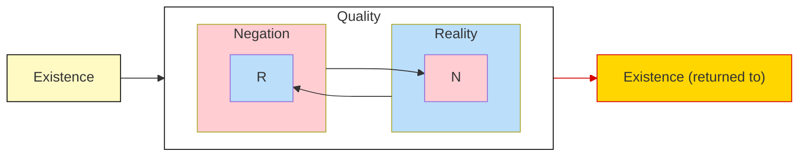

## The Development of Something

### Quality Undermines Itself

The category `something` (_Etwas_) develops out of
[`quality`](/articles/hegel/reference/quality/development), which itself
progressed from
[`existence` as such](/articles/hegel/reference/existence/development).

> In existence its determinateness has been distinguished as quality; in this
> quality as something existing, the distinction _exists_ &ndash; the
> distinction of reality and negation. Now though these distinctions are present
> in existence, they are just as much null and sublated. Reality itself contains
> negation; it is existence, not indeterminate or abstract being. Negation is
> for its part equally existence, not the supposed abstract nothing but posited
> here as it is in itself, as existent, as belonging to existence. Thus quality
> is in general unseparated from existence, and the latter is only determinate,
> qualitative being (Hegel 2010, 88/21.102-3).

`Quality` is the determinateness of `existence`. More specifically, `existence`
is either specified in terms of `reality` or `negation`. Crudely put, it signals
that which is real and that which is not there. Hegel emphasizes that
determinateness exists. It is not to be thought of as something separate from
existence or as that which lacks existence, since to qualify something as not
being there counts, in Hegel's eyes, as equally determining as qualifying
something as being real. Indeed, the two are logically inseparable.

```
Now though these distinctions are present in existence,
they are just as much null and sublated.
```

Hegel presses the idea that `reality` contains `negation` and vice versa, and in
so doing must designate them as sublated. Insofar as each is _contained_ in the
other, it has thereby rendered itself a moment of it. This signals that more is
at play than merely `reality` and `negation` since their mutual containment
points towards a higher context. Genealogically, their ancestor, so to speak, is
`existence` and so it would be their natural common identifier. However, it has
been discovered that this is essentially but one side of `quality`. The higher
context, therefore, must be that which contains both in their present
arrangement.

### Something Emerges

> This sublating of the distinction is more than the mere retraction and
> external re-omission of it, or a simple return to the simple beginning, to
> existence as such. The distinction cannot be left out, for it _is_. Therefore,
> what _de facto_ is at hand is this: existence in general, distinction in it,
> and the sublation of this distinction; the existence, not void of distinctions
> as at the beginning, but as _again_ self-equal _through the sublation of the
> distinction_; the simplicity of existence _mediated_ through this sublation.
> This state of sublation of the distinction is existence's own determinateness;
> existence is thus _being-in-itself_; it is _existent_, _something_ (Hegel
> 2010, 89/21.103).

The distinction of `quality` is undermined inasmuch as this distinction is to
hold absolutely. The distinction, rather, has sublated itself into a moment.
Now, while Hegel then warns that this does not yield a complete return to the
beginning of `existence` as such, there _is_ a return to `existence` in the
development. The qualitative distinction has proved to necessarily follow from
`existence`. What remains, then is to understand precisely this movement of
_return_.

```md
existence in general, distinction in it, and the sublation of this distinction;
the existence, not void of distinction as at the beginning, but as _again_
self-equal _through the sublation of the distinction_; the simplicity of
existence _mediated_ through this sublation
```

`Existence` is returned to through the sublation of distinction (or
determinateness), but it is important to emphasize exactly that it is _through_
the developments of `quality` that this occurs.



There is a small but significant difference between `existence` as such and
`existence` that is returned to through the mediation of `quality`. This is the
simple fact that the second `existence` (returned) is _mediated_ whereas the
first is _immediate_. This point is significant once the whole development is
viewed together.

`Quality` is a development of `existence`, indeed, it is the existent
_determinateness_. Likewise, `existence` is determined, or _qualified_, through
it. However, when `quality` is looked at more closely, it becomes apparent how
its two forms `reality` and `negation` form moments of one another. This then
showed that neither form is absolute and independent, and furthermore, that
`quality` itself proves to be a moment. But what is `quality` a moment of?

There is nowhere for determinateness to go, so to speak, than back to where it
came from, namely, `existence`. In fact, this is already built into
determinateness, since it was understood that determinateness is _existent_.

The distinction therefore is `existence`'s _own_ distinction. The difference
_of_ `existence` or the existent difference. The development thus traced is one
whereby determinacy is emitted from existent being and then, from within this
determinacy, it is reabsorbed back into its source. Yet it is not annihilated
upon its return, but made itself a moment that contained within another as that
being's _own_.

This generates an _internality_ to `existence` that is not evident in its
immediacy. This internal `being` that is differentiated within itself as such is
`being-in-itself` or `something`.

```md
This state of sublation of the distinction is existence's own determinateness;
existence is thus _being-in-itself_; it is _existent_, _something_.
```

Three things should be noted in the development of the category `something` so
far. First, with internality, a sense of _context_ has been achieved. With
context, layers and depth in the logic become possible. Second, a sense of
_ownership_ has been introduced into the logic: `quality` is now understood to
_belong_ to something. Determinateness is no longer free-standing but inherent
within a specific context. Finally, ownership hints at the idea&mdash;however
minimal&mdash;of singularity. Determinateness becomes individual and particular
to an specific context.

### Being-in-itself

Text
