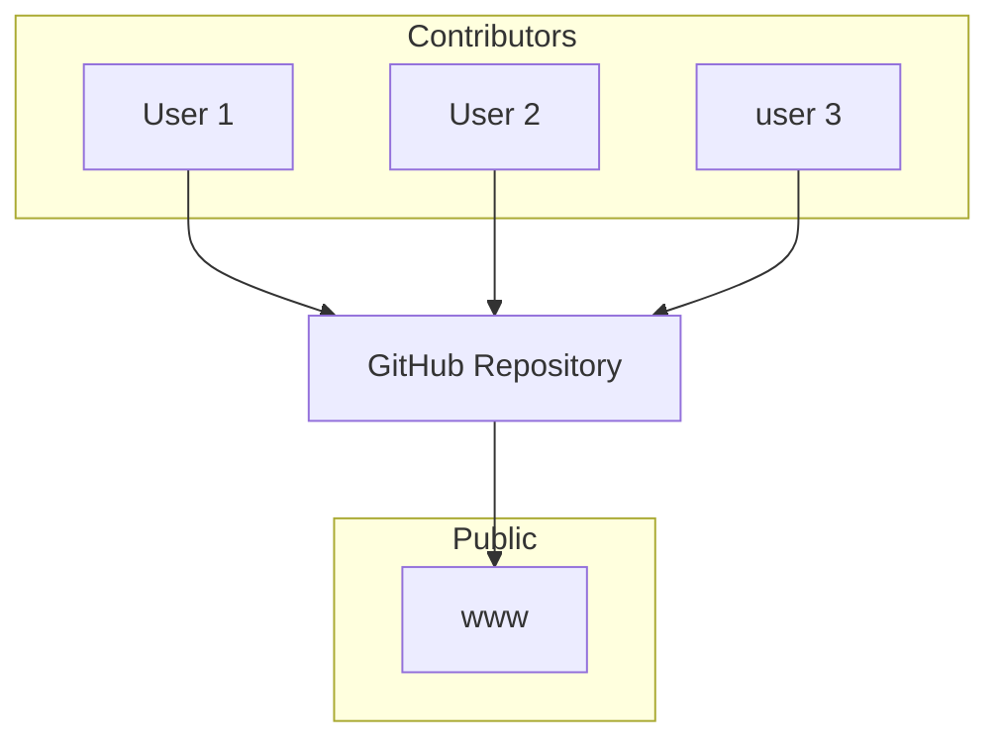
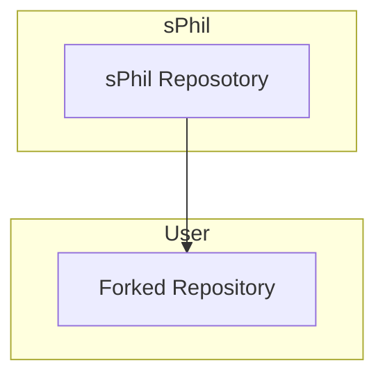
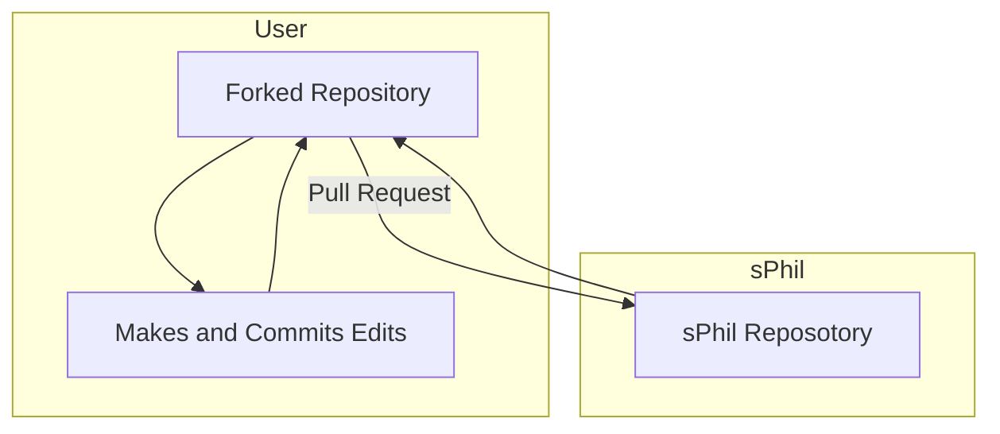

# GitHub: Conceptual Overview

GitHub is a web-based platform designed to facilitate collaborative software development. It serves as a hub for developers to work together on coding projects, track changes, and manage their code repositories. At its core, GitHub uses a version control system called Git, which helps developers manage and track changes to their code.

One of the fundamental concepts on GitHub is forking. Forking allows a user to create a copy of a repository (a collection of code files and related resources) from another user or organization's GitHub account. This forked repository becomes an independent copy of the original, enabling contributors to make changes without affecting the original codebase. This is particularly useful for suggesting improvements, fixing bugs, or adding new features.

Once you've forked a repository, you can clone it to your local development environment, which means you download a copy of the code to your computer, or you can interact directly with the code through GitHub. From whichever of the two development environment you choose to work from, you can make changes to the code as needed, following the project's guidelines or your own ideas for improvements.

After making changes, you create a new branch within your forked repository. Branches are like separate lines of development that allow you to work on specific features or bug fixes without affecting the main codebase. Once you've finished making your changes in the branch, you can create a pull request (PR) to propose these changes to the original repository.

A pull request is a request to the original repository's owner to review and merge your changes into their codebase. It includes a description of the changes, and the repository owner and collaborators can discuss the proposed changes, make additional comments, or request further modifications. Pull requests serve as a vital collaboration tool, enabling team members to evaluate code and ensure that it meets quality standards.

If your pull request is approved and merged into the original repository, your contributions become part of the project, and others can benefit from your work. This collaborative workflow is central to GitHub's purpose, as it allows developers from around the world to work together, share knowledge, and collectively improve software projects. It also provides transparency and accountability in software development, making it easier for developers to track changes, understand the project's history, and maintain a high-quality codebase.
