## General Division of the Logic

### The Major Divisions

```mermaid
mindmap
    root((The Science Of Logic))
        The Objective Logic
            📙 Doctrine of Essence
            📘 Doctrine of Being
        The Subjective Logic
            📔 The Doctrine of the Concept
```

_The Science of Logic_ is divided into two major parts or three doctrines. In accordance with the major parts, the _Logic_ is divided into _objective logic_ and _subjective logic_. The objective logic contains the doctrines: _The Doctrine of Being_ and _The Doctrine of Essence_, and the subjective logic contains _The Doctrine of the Concept_. Each of these doctrines deal with the development of logic in predominant descriptors, such as immediate existence, mediated or reflected determinations and explicit conceptual thought. In other words, each of these doctrines operate in ways that distinguish what is logically understood whether the matter is fundamentally immediate, mediated or a developmental integration of both. 

Hegel warns at the very start of the section General Division of The Logic&mdash;just following the [Introduction](/hegel/guides/science-of-logic-introduction)&mdash;that these divisions between parts and doctrines do not serve to philosophically determine the content of logic ahead of time, but are rather preliminary aids to help orient the reader. They are, therefore, pedagogical in nature and the full disclosure of the actual development is only found in following each determination or concept carefully from its beginning to its end. 

With that in mind, one can quickly get a basic lay of the land and get a sense of the project's key manuevers. Given that the logic will develop into the `concept`, whose logic is explicitly developmental, it becomes understood that the preceding doctrines are _moments_ of its development and are as such not as self-standing as they first were understood to be&mdash;indeed, Hegel's argument is that these categories or determinations are internally inadequate. This means that everything in the logic becomes oriented around the `concept` and, finally, the `idea`. The `idea` then further develops into space and time, nature, human minded activity, but these are beyond the scope of pure thought, which is what the _Science of Logic_ is concerned with. 

> Therefore the earlier determinations which (on the _pathway to truth_) _existed for themselves_, as for instance, that of subjective and objective, or also of thought and being, of concept and reality, no matter from what standpoint they were determined, are _now in their truth_, that is, in their unity, _reduced to forms_. In their difference they therefore implicitly remain, _in themselves_, the whole concept, and this concept is posited in the division only under its own determinations (Hegel, 2010, 39/21.45).

_The objective logic_ contains the Doctrines of Being and Essence. The former concerns determinations or concepts that are typically understood to exist immediately, such as `being`, `existence`, `quality`, the ` one`, the `many` and so forth. The latter has terms typically understood to exist mediately, such as `essence`, `shine`, `difference`, `ground`, `form`, `content`, `appearance`, `relation`, `actuality`, `causality` and son. In more technical terms, the entire part is the concept _implicitly in itself_.

_The subjective logic_, on the other hand, concerns explicitly conceptual determinations, such as `universality`, `particularity`, `singularity`, `judgment`, `inference`, `means`, `purpose`, `cognition` and many more. This is the concept _that exists for itself_.

### A Dialectic of the Divisions 

The Objective- and Subjective Logic  is essentially the first broad division made of the _Science of Logic_. However, as Hegel notes, being and the concept do not stand wholly apart from each other but are related. Indeed, their very difference logically establishes a link between the two. This reference constitutes a particular logic unto itself that is known as the sphere of mediation or _The Doctrine of Essence_. As Hegel elaborates:

> [The sphere of mediation is] the concept as a system of _reflected determinations_, that is, of being as it passes over into the in-itselfness of the concept &ndash; a concept which is in this way not yet posited for itself _as such_ but also fettered by an immediate being still external to it (Hegel, 2010, 40/21.46).

The _difference_ between being and thought necessitates a third element between them and so it is more precise to divide the logic into three doctrines rather than two parts. Hegel also notes that with essence the stalwart objectivity of being is progressively denigrated to include the inwardness of the concept; however, precisely for that very reason, the concept is unable to be made fully explicit while the immediacy of being persists. Essence is therefore the purgation of the concept, as it were, since the concept is actively failing to be the concept proper while being remains something immediately external to it and so must overcome these failures by the discovery of a logic that is not bound by mere difference. 

## Further Remarks

### On the Term Element

Hegel highlights the term _element_ when discussing the unity of the doctrines. As George di Giovanni notes in his translation, element has classical connotations harkening back to the four elements of "air", "water", "earth" and "fire" where it is understood that something has an underlying nature of its own _but also_ has implied  modes of being or relationships to other elements (Hegel, 2010, 39). In Aristotle, we find element defined as: 

> An element, we take it, is a body into which other bodies may be analysed, present in them potentially or in actuality (which of these, is still disputable), and not itself divisible into bodies different in form (Aristotle, 2001, On the Heavens, Book III, Chapter III). 

As far as Aristotle was concerned then, an element cannot be divided into bodies of a different form, such that if one were to divide "air", one would not receive "fire" or "earth". Whether this is still valid for Hegel is not clear here, but what is clear is that logic principally understood as element persists throughout its many divisions or transformations and is therefore _the_ unity. 

However, what might contrast to the thinking of element as a kind of "building block" is the fact that the logical developments of the concept are non-regressive. That is to say, the progression of thought cannot be reverted back to its constituents. As Hegel confirms:

> For since the division is ... the _parting_ or the _judgment_ of the concept &ndash; is the positing of the determination which is already immanent in it and therefore the positing of its distinction &ndash; this positing must not be understood as resolving that concrete unity back into its determinations, as if these were to exist on their own, for this would be here a vacuous return to the previous standpoint, to the opposition of consciousness. But this opposition has vanished; the unity remains the element, and the distinctions of the division and of the development in general no longer transgress that unity (Hegel, 2010, 39/21.45). 

Positing&mdash;here meaning putting something as explicit&mdash;develops the content further and reveals new details about it. This further account cannot be said to be part of the constituents as they were but must be part of them as they develop. In the context of thought and consciousness, the latter is oriented around an subject-object opposition whereas in thought, by contrast, this opposition has _vanished_, leaving logic as the sole element of which any further distinctions and classifications form moments. 

### Logic from Kant to Hegel (Niklas)

Hegel compares his logic and its constituents to Kant's and notes some differences. First, without controversy, Kant makes a distinction between general logic and transcendental logic, the latter being the logic concerning experience or cognition (or how objects appear) whilst the former being the logic that concerns logic as such. For Kant, while transcendental logic may be erroneous or differ depending on the kind of creature that is in question (human being, God, alien, etc.), general logic can never be in error. Said otherwise, my cognitive apparatus generates a particular kind of experience of the world that is peculiar to me _as a human being_ and outside of which I cannot make any truthful claims about the world and its object; but these experiences or claims must accord with the rules of general logic, such that I cannot have an experience that would ever violate general logic. General logic alone, in contrast, is insufficient to provide any positive claims about the world and its objects. 

Second, and perhaps more controversially, Hegel claims Kant's principal aim to is to vindicate the categories (or determinations) for self-consciousness understood as the subjective `I`, and because of this "his point of view remains confined within consciousness and its opposition, and, besides the empirical element of feeling and intuition, is left with something else not posited or determined by thinking self-consciousness, a _thing-in-itself_" (Hegel, 2010, 41/21.47). Here Hegel claims that Kant's method is confined within consciousness, which for Hegel is always something oriented through a subject-object dichotomy, such that it is systematically limited. He then points to two other elements that must be externally given for the system to be coherent: the _empirical_ element of feelings and intuition and the element of a thing-in-itself. If Kant's aim is to vindicate the categories of _self-consciousness_, then inserting anything empirical or of what is essentially non-categorical in nature, is at least problematic. Moreover, the other element of a thing-in-itself is definitively not empirical and yet it must follow from the transcendental analysis since the human being is prone to misuse the categories of the understanding, such that from the presupposition of something empirical follows something wholly non-empirical. 

Third, the objectification of the `I`, or what could be called the real process whereby the `I` becomes a representation for itself, can be understood as an "original and necessary deed of consciousness" (Hegel, 2010, 41/21.47) such that this essentially precedes the subject-object dichotomy integral to consciousness. But then this should not be called consciousness anymore, Hegel says, since consciousness is explicitly that for which "holds within itself the opposition of the 'I', and its intended object which is not to be found in that original deed" (Hegel, 2010, 41/21.47-48). Where this opposition has ceased the matter should not be termed consciousness but thought.

We see here that for all the shortcomings of Kant's system (if Hegel is right), there are key links in the manner both these philosophers build their systems. Where Kant essentially begins with what is most immediate to consciousness&mdash;pure intuitions of space and time&mdash;Hegel refines these categories further to those that concern immediacy pure and simple, such as `being` and `nothing`. Gone is the presupposition of an empirical reality where the examination of pure thought is concerned, there is only, minimally, the immediate being of that thought&mdash;which is exactly _not_ external to that thought (see also [Presuppositionless Thinking](/hegel/guides/presuppositionless-thinking)). Now, this is not to deny that there is such a thing as empirical reality, but following Hegel's systematic development, whatever empirical reality turns out to be, it cannot be less than [immediate being, which _also_ overlaps with thought](/hegel/guides/science-of-logic-introduction#logic-as-non-metaphysical), such that this category is shared between empirical reality and thought. This solves the problem of mediation between thought and being, or subjectivity and objectivity, since from the start the least that empirical reality can be is also minimally conceptual or logical.

Furthermore, if it is true that the objectification of the `I` (Hegel likely has Kant's principle of the synthetic unity of apperception in mind here) is the _deed_ of self-consciousness that brings to the fore the `I` as represented for itself, then here we have something essentially self-determining, and with Hegel equating it to thinking as such, there seems to be a strong correlation here between this deed and Hegel's own account of `the concept`. However, Kant's conception of the concept (if this correlation obtains) is marred with baggage of empirical intuition whose precise status vis-à-vis concepts is left wanting as well as the specter of the thing-in-itself, such that its conceptual method never really comes to light.

> Now because the interest of the Kantian philosophy was directed to the so-called _transcendental_ nature of the categories, the treatment itself of such categories came up empty. What they are in themselves apart from their abstract relation to the "I," a relation which is the same for all, how they are determined and related to each other, this was not made a subject of consideration, and therefore knowledge of their nature was not in the least advanced by this philosophy (Hegel, 2010, 41/21.48).

If the treatment of the categories comes up empty, then there is essentially no developmental understanding at play and therefore `the concept` is itself lacking. Kant only stumbles, as it were, over the concept following his transcendental inquiry&mdash;but it speaks to the _power_ of Kant's thought that he is, despite systematic limitations, able to discover and appreciate the underlying conceptual movement necessarily at work in pure intuitions and categories of the understanding. 

Finally, Hegel deals with the Kantian thing-in-itself as part of the dialectical development of logic, particularly in the Doctrine of Essence where this determination receives its treatment in both as the thing in itself and as the world in and for itself. Here it is seen how this determination necessarily follows from the determination of thing, and subsequently from the world that appears, but that it also then becomes later sublated in the following `essential relation` between the world that appears and the world that is in and for itself. Now, this actually serves to vindicate Kant somewhat since the idea of the thing-in-itself, even in Hegel's own estimate, necessary follows from the logical development and therefore cannot be, as Hegel repeatedly writes, something external or alien to thinking.[^1]

[^1]: One could come to Hegel's defense here and say that it is _how_ Kant treats the thing-in-itself which makes abstract and alien to thought, but given Hegel's frequent assaults on the very idea of a thing-in-itself, this defense seems weak.

### The Objective Logic Replaces Former Metaphysics

Hegel states that the objective logic takes the place of former metaphysics inasmuch as that was a metaphysics that understood reality purely in terms of ideas and principles. More specifically, Hegel's objective logic aims to supplant ontology in the classical sense of being the philosophical treatment of things (_ens_). There are, however, a number of other ideas and principles that the older metaphysics were very concerned with but that Hegel's ontology will jettison, such as the soul, the world, God, and others.[^2] In Hegel's estimate, these ideas are subjects of _figurative imagination_ rather than categories of thought and his aim is to conduct his examination of the categories of thought free from the intermingling of figurative or representational content. 

Hegel praises Kant for leveraging the just reproach on the older metaphysics which employed the forms of thought, pure or mixed with figurative content, _uncritically_, without first conducting an investigation into the nature of knowing and its limits. Hegel claims, following the spirit of Kant in being self-critical in one's considerations, that his objective logic is the true critique of the ideas and principles of ontology. In contrast to Kant, however, Hegel will not consider these ideas _in light of_ cognition or from the vantage point of a system of _a priori_ (before the fact) and _a posteriori_ (after the fact), but simply from their own innate content. This is to say, Hegel will not, for example, consider the idea of existence from the standpoint of human cognition, but from its own standpoint&mdash;what existence _is_ according to its concept. Hegel does this because this is what it means to be truly critical about the ontological ideas and principles. 

[^2]: Hegel also mentions "the world" but his own Doctrine of Essence will examine the world that appears and the world in and for itself, so that what he says here vis-à-vis what his objective logic will investigate exactly is a little misleading. Furthermore, the `soul` is treated later in his _Philosophy of Spirit_ as well as `God` in his examination of religion, both of which can be viewed as extensions of ontology given that the _Philosophy of Spirit_ systematically follows the _Philosophy of Nature_, which in turn follows the _Logic_. However, it is unsettled, or at least unclear, the extent to which these later parts of the system concerning _Realphilosophie_ can be genuinely considered ontology if ontology concerns the logic of being considered in terms of pure thought or in terms of thought as such. 

One can get a brief glimpse of the debt Hegel has to Kant's philosophy since it was Kant that inaugurated a systematic critique of cognition, metaphysics, ontology and experience that made more precise inroads into the difference between figurative imagination and conceptual thinking, and thus paved the way for Hegel's own treatment of ontology and metaphysics with further critical focus.

## Works Cited

- Aristotle, _The Basic Works of Aristotle_. Edited by Richard McKeon, The Modern Library, 2001.
- Hegel, Friedrich Georg Wilhelm. _The Science of Logic_. Translated by George di Giovanni, Cambridge University Press, 2010.

---

**Authors**  
Filip Niklas (2024)

**Editors**  
Ahilleas Rokni (2024)

---

**Notes**